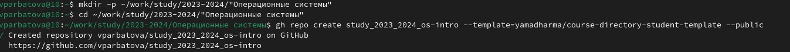

---
## Front matter
lang: ru-RU
title: Презентация по лабораторной работе №2
subtitle: Операционные системы
author:
  - Арбатова В. П., НКАбд-01-23
institute:
  - Российский университет дружбы народов, Москва, Россия
date: 1 марта 2023

## i18n babel
babel-lang: russian
babel-otherlangs: english

## Formatting pdf
toc: false
toc-title: Содержание
slide_level: 2
aspectratio: 169
section-titles: true
theme: metropolis
header-includes:
 - \metroset{progressbar=frametitle,sectionpage=progressbar,numbering=fraction}
 - '\makeatletter'
 - '\beamer@ignorenonframefalse'
 - '\makeatother'
---

# Цель работы

Изучить идеологию и применение средств контроля версий, освоить умения по работе с git

# Задание

1. Создать базовую конфигурацию для работы с git
2. Создать ключ SSH
3. Создать ключ PGP
4. Настроить подписи git
5. Зарегистрироваться на Github
6. Создать локальный каталог для выполнения заданий по предмету

# Выполнение лабораторной работы

## Базовая настройка git
Устанавливаю git, задаю имя и email владельца репозитория, настраиваю utf-8 в выводе сообщений git, задаю имя начальной ветки

{#fig:001 width=70%}

## Базовая настройка git

Устанавливаю параметры autoctlf, safecrlf

{#fig:002 width=70%}

## Создание ключей SSH

По алгоритму rsa с ключём размером 4096 бит

{#fig:003 width=70%}\

## Создание ключей SSH

По алгоритму ed25519

{#fig:004 width=70%}

## Создание ключей SSH

Копирую ssh ключ

{#fig:005 width=70%}

## Создание ключей SSH

Вставляю скопированный ключ в поле для ssh ключа

{#fig:006 width=70%}

## Создание ключей PGP

Генерирую ключ

{#fig:007 width=70%}

## Создание ключей PGP

Заполняю данные, задаю пароль

{#fig:008 width=70%}

## Добавление PGP ключа в GitHub

Вывожу список ключей и копирую отпечаток приватного ключа

{#fig:009 width=70%}

## Добавление PGP ключа в GitHub

Копирую сгенерированный PGP ключ в буфер обмена

{#fig:010 width=70%}

## Добавление PGP ключа в GitHub

Добавляю PGP ключ на сайт

{#fig:011 width=70%}

## Добавление PGP ключа в GitHub

Используя введённый email, указываю git применять его при подписи коммиров

{#fig:012 width=70%}

## Добавление PGP ключа в GitHub

Скачиваю gh и авторизируюсь

{#fig:013 width=70%}

## Добавление PGP ключа в GitHub

Авторизировалась

{#fig:014 width=70%}

## Добавление PGP ключа в GitHub

Создаю каталог курса

{#fig:015 width=70%}

## Добавление PGP ключа в GitHub

Клонирую репозиторий

{#fig:016 width=70%}

## Добавление PGP ключа в GitHub

Перехожу в каталог курса, удаляю лишние файлы, создаю необходимые каталоги, отправляю файлы на сервер

{#fig:017 width=70%}

# Выводы

я изучила идеологию и применение средств контроля версий, освоила умения по работе с git

# Список литературы{.unnumbered}

::: {#refs}

:::

