---
## Front matter
title: "Отчёт по лабораторной работе №2"
subtitle: "Операционные системы"
author: "Арбатова Варвара Петровна"

## Generic otions
lang: ru-RU
toc-title: "Содержание"

## Bibliography
bibliography: bib/cite.bib
csl: pandoc/csl/gost-r-7-0-5-2008-numeric.csl

## Pdf output format
toc: true # Table of contents
toc-depth: 2
lof: true # List of figures
lot: true # List of tables
fontsize: 12pt
linestretch: 1.5
papersize: a4
documentclass: scrreprt
## I18n polyglossia
polyglossia-lang:
  name: russian
  options:
	- spelling=modern
	- babelshorthands=true
polyglossia-otherlangs:
  name: english
## I18n babel
babel-lang: russian
babel-otherlangs: english
## Fonts
mainfont: PT Serif
romanfont: PT Serif
sansfont: PT Sans
monofont: PT Mono
mainfontoptions: Ligatures=TeX
romanfontoptions: Ligatures=TeX
sansfontoptions: Ligatures=TeX,Scale=MatchLowercase
monofontoptions: Scale=MatchLowercase,Scale=0.9
## Biblatex
biblatex: true
biblio-style: "gost-numeric"
biblatexoptions:
  - parentracker=true
  - backend=biber
  - hyperref=auto
  - language=auto
  - autolang=other*
  - citestyle=gost-numeric
## Pandoc-crossref LaTeX customization
figureTitle: "Рис."
tableTitle: "Таблица"
listingTitle: "Листинг"
lofTitle: "Список иллюстраций"
lotTitle: "Список таблиц"
lolTitle: "Листинги"
## Misc options
indent: true
header-includes:
  - \usepackage{indentfirst}
  - \usepackage{float} # keep figures where there are in the text
  - \floatplacement{figure}{H} # keep figures where there are in the text
---

# Цель работы

Изучить идеологию и применение средств контроля версий, освоить умения по работе с git

# Задание

1. Создать базовую конфигурацию для работы с git
2. Создать ключ SSH
3. Создать ключ PGP
4. Настроить подписи git
5. Зарегистрироваться на Github
6. Создать локальный каталог для выполнения заданий по предмету

# Выполнение лабораторной работы

## Базовая настройка git
Устанавливаю git, задаю имя и email владельца репозитория, настраиваю utf-8 в выводе сообщений git, задаю имя начальной ветки

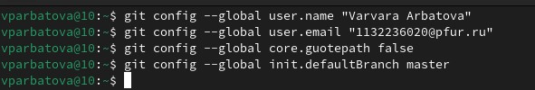{#fig:001 width=70%}

Устанавливаю параметры autoctlf, safecrlf

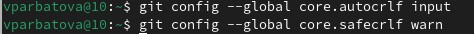{#fig:002 width=70%}

## Создание ключей SSH

По алгоритму rsa с ключём размером 4096 бит

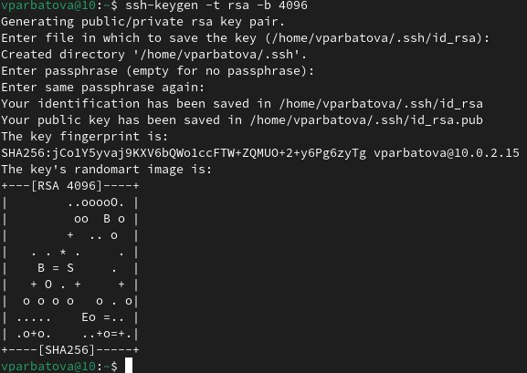{#fig:003 width=70%}

По алгоритму ed25519

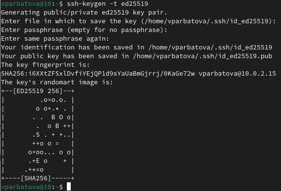{#fig:004 width=70%}

Копирую ssh ключ

{#fig:005 width=70%}

Вставляю скопированный ключ в поле для ssh ключа

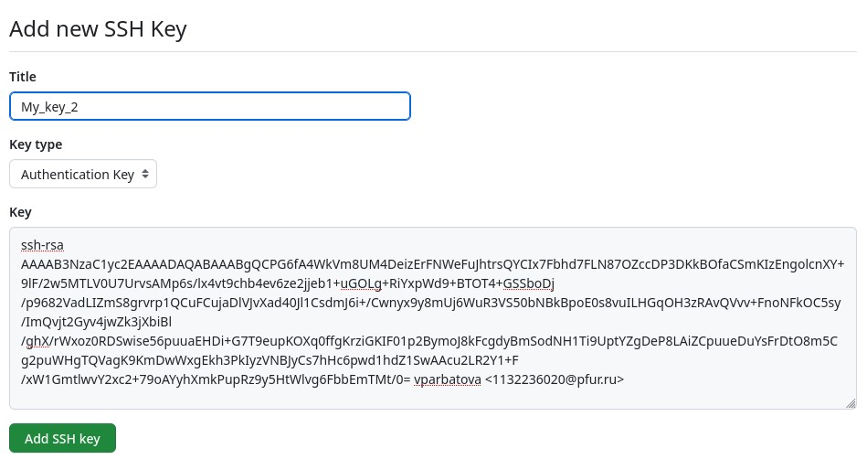{#fig:006 width=70%}

## Создание ключей PGP

Генерирую ключ

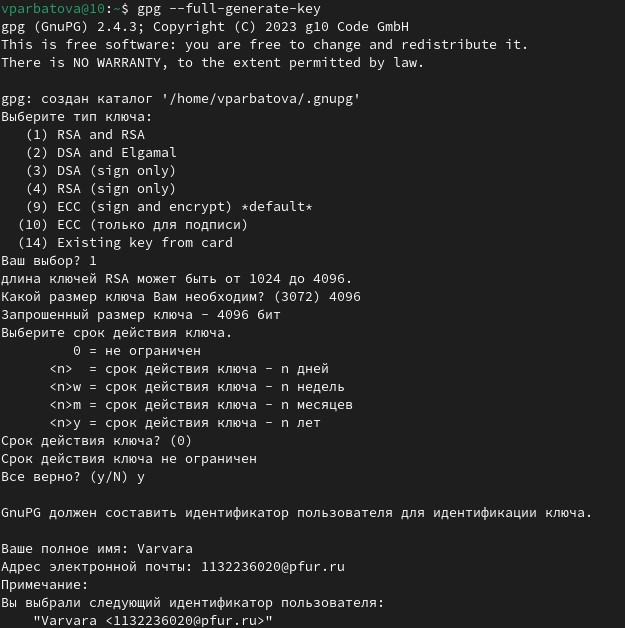{#fig:007 width=70%}

Заполняю данные, задаю пароль

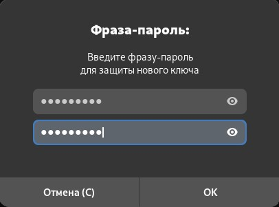{#fig:008 width=70%}

## Добавление PGP ключа в GitHub

Вывожу список ключей и копирую отпечаток приватного ключа

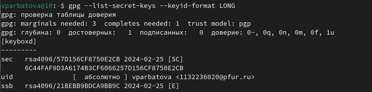{#fig:009 width=70%}

Копирую сгенерированный PGP ключ в буфер обмена

{#fig:010 width=70%}

Добавляю PGP ключ на сайт

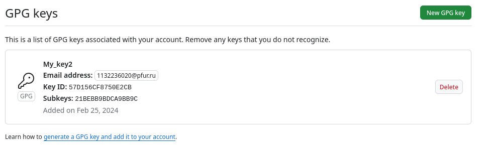{#fig:011 width=70%}

Используя введённый email, указываю git применять его при подписи коммиров

{#fig:012 width=70%}

Скачиваю gh и авторизируюсь

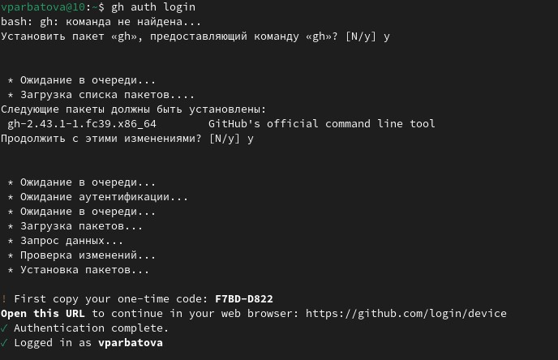{#fig:013 width=70%}

Авторизировалась

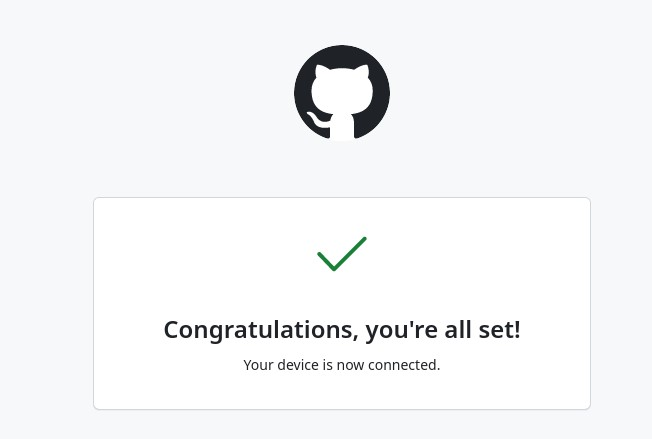{#fig:014 width=70%}

Создаю каталог курса

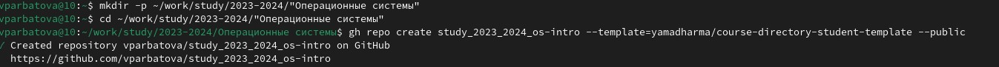{#fig:015 width=70%}

Клонирую репозиторий

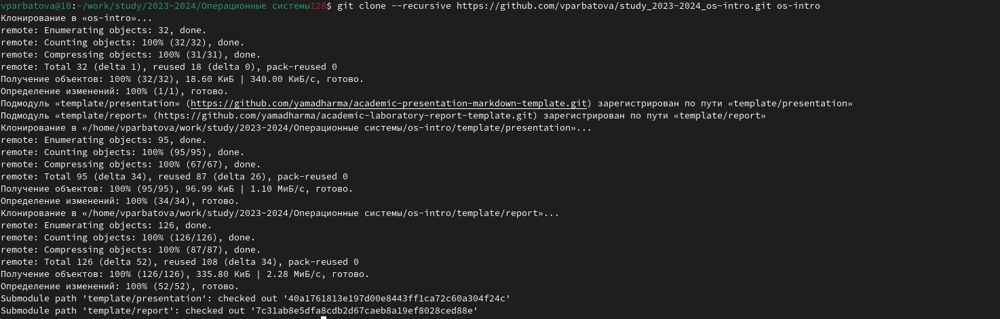{#fig:016 width=70%}

Перехожу в каталог курса, удаляю лишние файлы, создаю необходимые каталоги, отправляю файлы на сервер

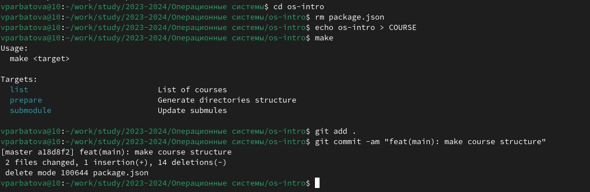{#fig:017 width=70%}

# Выводы

Здесь кратко описываются итоги проделанной работы.

# Список литературы{.unnumbered}

::: {#refs}
:::
