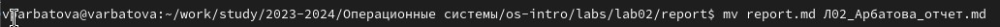
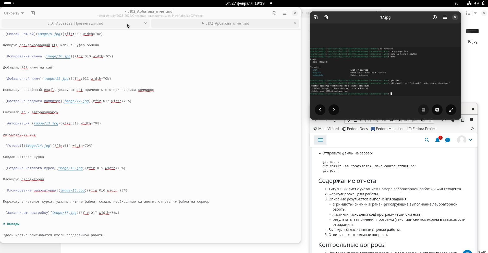
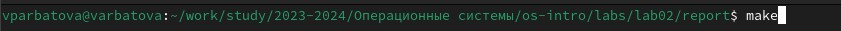
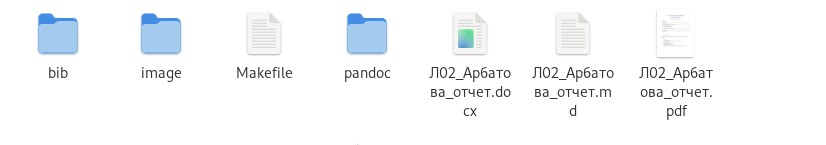

---
## Front matter
lang: ru-RU
title: Презентация по лабораторной работе №3
subtitle: Операционные системы
author:
  - Арбатова В.П., НКАбд-01-23
institute:
  - Российский университет дружбы народов, Москва, Россия
date: 01 марта 2024

## i18n babel
babel-lang: russian
babel-otherlangs: english

## Formatting pdf
toc: false
toc-title: Содержание
slide_level: 2
aspectratio: 169
section-titles: true
theme: metropolis
header-includes:
 - \metroset{progressbar=frametitle,sectionpage=progressbar,numbering=fraction}
 - '\makeatletter'
 - '\beamer@ignorenonframefalse'
 - '\makeatother'
---

## Цель работы

Научиться оформлять отчёты с помощью легковесного языка разметки Markdown

## Задание

Оформить отчёт по предыдущей лабораторной работе 

## Выполнение лабораторной работы

Перехожу в папку lab02/report, переименовываю файл

{#fig:001 width=70%}

## Выполнение лабораторной работы

Процесс выполнения лабораторной работы

{#fig:002 width=70%}

## Выполнение лабораторной работы

Выполняю команду make

{#fig:003 width=70%}

## Выполнение лабораторной работы

Готовые отчёты в разных форматах

{#fig:004 width=70%}

# Выводы

Я научилась оформлять отчёты с помощью легковесного языка разметки Markdown

# Список литературы{.unnumbered}

::: {#refs}
:::
