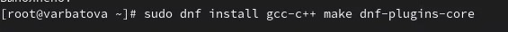

---
## Front matter
lang: ru-RU
title: Презентация по лабораторной работе №4
subtitle: Операционные системы
author:
  - Арбатова В. П., НКАбд-01-23
institute:
  - Российский университет дружбы народов, Москва, Россия
date: 9 марта 2024

## i18n babel
babel-lang: russian
babel-otherlangs: english

## Formatting pdf
toc: false
toc-title: Содержание
slide_level: 2
aspectratio: 169
section-titles: true
theme: metropolis
header-includes:
 - \metroset{progressbar=frametitle,sectionpage=progressbar,numbering=fraction}
 - '\makeatletter'
 - '\beamer@ignorenonframefalse'
 - '\makeatother'
---

# Цель работы

Получение навыков правильной работы с репозиторием git

# Задание

Выполнить работу для тестового репозитория, преобразовать рабочий репозиторий в репозиторий с git-flow и conventional commits

# Выполнение лабораторной работы
## Установка git-flow

Устанавливаю git-flow из коллекции репозиторием coper

{#fig:001 width=70%}

## Установка Node.js

Устанавливаю node.js

{#fig:002 width=70%}

## Установка Node.js

Обновляю пакеты системы

{#fig:003 width=70%}

## Установка Node.js

Скачиваю необходимое обеспечение для установки pnpm

{#fig:004 width=70%}

## Установка Node.js

Скачиваю pnpm

{#fig:005 width=70%}

## Настройка Node.js

Запускаю каталог с исполняемыми файлами, включаю функцию форматирования коммитов, создания логов

{#fig:006 width=70%}

## Создание временного репозитория

Создаю новый репозиторий

{#fig:007 width=70%}

## Создание временного репозитория

Создаю каталог для работы с этим репозиторием и перехожу в него (всю настройку надо было выполнять в нём, я сделала это на видео)

{#fig:008 width=70%}

## Создание временного репозитория

Подключаюсь к этому репозиторию

{#fig:009 width=70%}

## Создание временного репозитория

Конфигурация пакетов node.js. Теперь в этом репозитории можно работать с этим пакетом

{#fig:010 width=70%}

## Создание временного репозитория

Открываю и редактирую файл так, как написано

{#fig:011 width=70%}

## Создание временного репозитория

Добавляю файлы, выполняю коммит, отправляю на github

{#fig:012 width=70%}

## Создание временного репозитория

Инициализирую git-flow, проверяю, на какой я ветке

{#fig:013 width=70%}

## Создание временного репозитория

Загружаю весь репозиторий в хранилище, устанавливаю внешнюю ветку как вышестоящую для этой ветки, создаю релиз с версией 1.0.0

{#fig:014 width=70%}

## Создание временного репозитория

Создаю журнал изменений, добавляю журнал изменений в индекс, выгружаю релизную ветку в основную

{#fig:015 width=70%}

## Создание временного репозитория

Выполняю указания

{#fig:016 width=70%}

## Создание временного репозитория

Отправляю данные на github, создаю релиз

{#fig:017 width=70%}

## Создание временного репозитория

Создаю ветку для новой функциональности, объединяю две ветки

{#fig:018 width=70%}

## Создание временного репозитория

Изменяю номер версии

{#fig:019 width=70%}

## Создание временного репозитория

Повторяю инструкции для добавления журнала изменений в индекс

{#fig:020 width=70%}

{#fig:021 width=70%}

# Выводы

Я получила навыки правильной работы с репозиторием git

# Список литературы{.unnumbered}

::: {#refs}
:::
