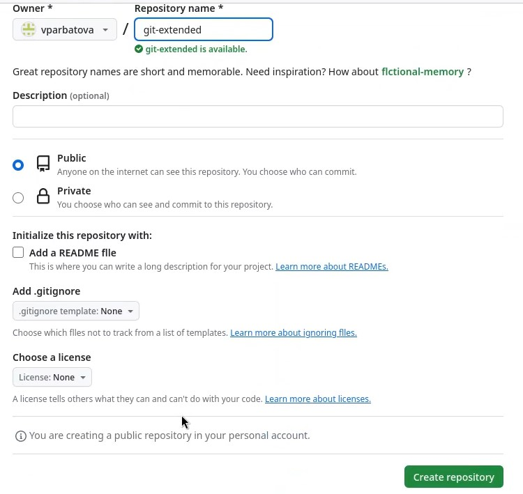
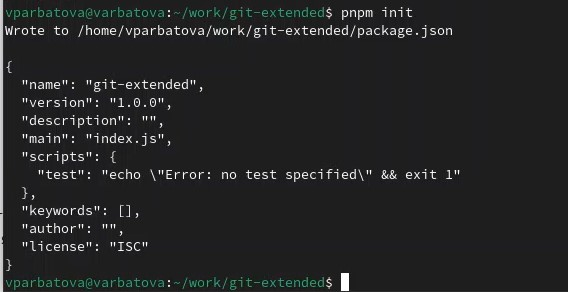
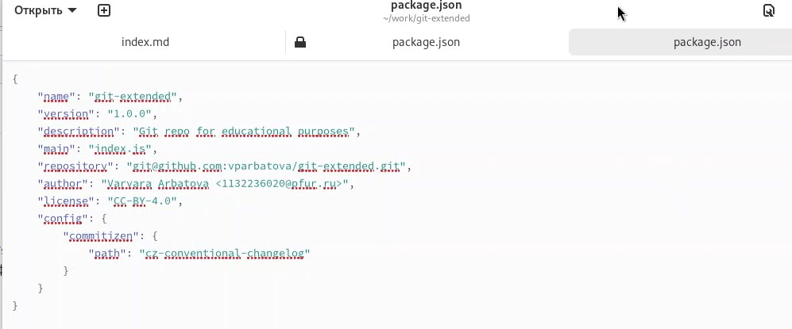
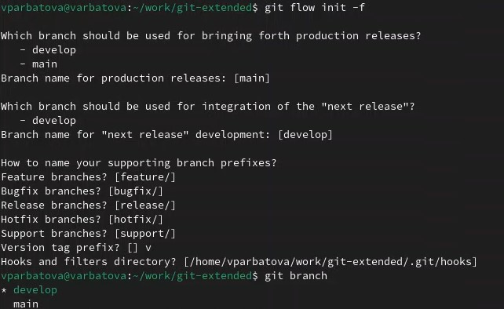
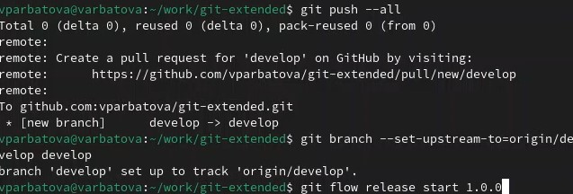
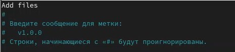
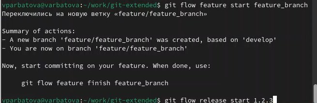
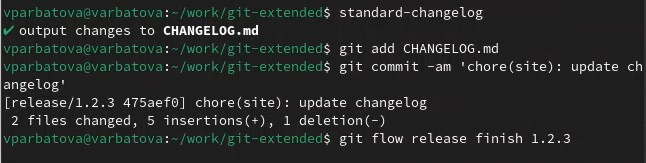
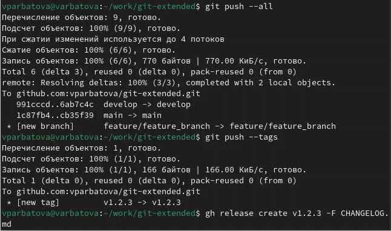

---
## Front matter
title: "Отчёт по лабораторной работе №4"
subtitle: "Простейший вариант"
author: "Арбатова Варвара Петровна"

## Generic otions
lang: ru-RU
toc-title: "Содержание"

## Bibliography
bibliography: bib/cite.bib
csl: pandoc/csl/gost-r-7-0-5-2008-numeric.csl

## Pdf output format
toc: true # Table of contents
toc-depth: 2
lof: true # List of figures
lot: true # List of tables
fontsize: 12pt
linestretch: 1.5
papersize: a4
documentclass: scrreprt
## I18n polyglossia
polyglossia-lang:
  name: russian
  options:
	- spelling=modern
	- babelshorthands=true
polyglossia-otherlangs:
  name: english
## I18n babel
babel-lang: russian
babel-otherlangs: english
## Fonts
mainfont: PT Serif
romanfont: PT Serif
sansfont: PT Sans
monofont: PT Mono
mainfontoptions: Ligatures=TeX
romanfontoptions: Ligatures=TeX
sansfontoptions: Ligatures=TeX,Scale=MatchLowercase
monofontoptions: Scale=MatchLowercase,Scale=0.9
## Biblatex
biblatex: true
biblio-style: "gost-numeric"
biblatexoptions:
  - parentracker=true
  - backend=biber
  - hyperref=auto
  - language=auto
  - autolang=other*
  - citestyle=gost-numeric
## Pandoc-crossref LaTeX customization
figureTitle: "Рис."
tableTitle: "Таблица"
listingTitle: "Листинг"
lofTitle: "Список иллюстраций"
lotTitle: "Список таблиц"
lolTitle: "Листинги"
## Misc options
indent: true
header-includes:
  - \usepackage{indentfirst}
  - \usepackage{float} # keep figures where there are in the text
  - \floatplacement{figure}{H} # keep figures where there are in the text
---

# Цель работы

Получение навыков правильной работы с репозиторием git

# Задание

Выполнить работу для тестового репозитория, преобразовать рабочий репозиторий в репозиторий с git-flow и conventional commits

# Выполнение лабораторной работы
## Установка git-flow

Устанавливаю git-flow из коллекции репозиторием coper

{#fig:001 width=70%}

## Установка Node.js

Устанавливаю node.js

{#fig:002 width=70%}

Обновляю пакеты системы

{#fig:003 width=70%}

Скачиваю необходимое обеспечение для установки pnpm

{#fig:004 width=70%}

Скачиваю pnpm

{#fig:005 width=70%}

## Настройка Node.js

Запускаю каталог с исполняемыми файлами, включаю функцию форматирования коммитов, создания логов

{#fig:006 width=70%}

## Создание временного репозитория

Создаю новый репозиторий

{#fig:007 width=70%}

Создаю каталог для работы с этим репозиторием и перехожу в него (всю настройку надо было выполнять в нём, я сделала это на видео)

{#fig:008 width=70%}

Подключаюсь к этому репозиторию

{#fig:009 width=70%}

Конфигурация пакетов node.js. Теперь в этом репозитории можно работать с этим пакетом

{#fig:010 width=70%}

Открываю и редактирую файл так, как написано

{#fig:011 width=70%}

Добавляю файлы, выполняю коммит, отправляю на github

{#fig:012 width=70%}

Инициализирую git-flow, проверяю, на какой я ветке

{#fig:013 width=70%}

Загружаю весь репозиторий в хранилище, устанавливаю внешнюю ветку как вышестоящую для этой ветки, создаю релиз с версией 1.0.0

{#fig:014 width=70%}

Создаю журнал изменений, добавляю журнал изменений в индекс, выгружаю релизную ветку в основную

{#fig:015 width=70%}

Выполняю указания

{#fig:016 width=70%}

Отправляю данные на github, создаю релиз

{#fig:017 width=70%}

Создаю ветку для новой функциональности, объединяю две ветки

{#fig:018 width=70%}

Изменяю номер версии

{#fig:019 width=70%}

Повторяю инструкции для добавления журнала изменений в индекс

{#fig:020 width=70%}

{#fig:021 width=70%}

# Выводы

Я получила навыки правильной работы с репозиторием git

# Список литературы{.unnumbered}

::: {#refs}
:::
