---
## Front matter
lang: ru-RU
title: Презентация по лабораторной работе №5
subtitle: Операционные системы
author:
  - Арбатова В.П., НКАбд-01-23
institute:
  - Российский университет дружбы народов, Москва, Россия
date: 16 марта 2024

## i18n babel
babel-lang: russian
babel-otherlangs: english

## Formatting pdf
toc: false
toc-title: Содержание
slide_level: 2
aspectratio: 169
section-titles: true
theme: metropolis
header-includes:
 - \metroset{progressbar=frametitle,sectionpage=progressbar,numbering=fraction}
 - '\makeatletter'
 - '\beamer@ignorenonframefalse'
 - '\makeatother'
---

# Цель работы

Настройка рабочей среды, установка менеджера паролей pass 

# Задание

Установка и настройка менеджера паролей pass, настройка управления файлами конфигурации, установка дополнительного по

# Теоретическое введение

Менеджер паролей pass — программа, сделанная в рамках идеологии Unix.
Также носит название стандартного менеджера паролей для Unix (The standard Unix password manager).

# Выполнение лабораторной работы

## Установка менеджера паролей pass

Скачиваю pass

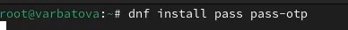{#fig:001 width=70%}

## Установка менеджера паролей pass

Скачиваю gopass

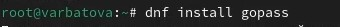{#fig:002 width=70%}

## Настрока

Просматриваю список ключей GPG 

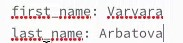{#fig:003 width=70%}

## Настрока

Инициализирую хранилище

{#fig:004 width=70%}

## Настрока

Создаю структуру git

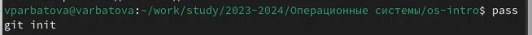{#fig:005 width=70%}

## Настрока

Создаю новый репозиторий

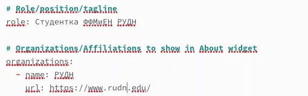{#fig:006 width=70%}

## Настрока

7-8: Синхронизирую

{#fig:007 width=70%}
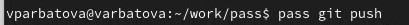{#fig:008 width=70%}

## Настрока

Коммичу изменения вручную

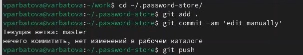{#fig:009 width=70%}

## Настрока

Проверяю статус изменений

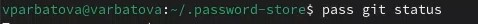{#fig:010 width=70%}

## Настрока

11-12: Устанавливаю интерфейс взаимодействия с броузером - native messaging
 
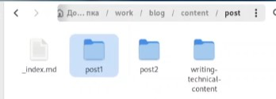{#fig:011 width=70%}
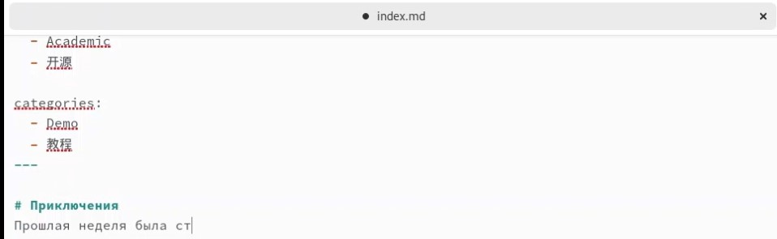{#fig:012 width=70%}

## Настрока

Создала файл, на который буду ставить пароль, затем - задаю этот пароль, отображаю его и заменяю на генерируемый автоматически

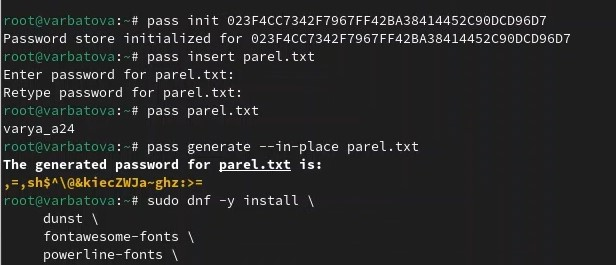{#fig:013 width=70%}

## Установка доп по

14-16: Установка шрифтов. Я забыла скриншот сделать, но до этого было установлено по

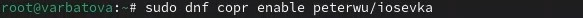{#fig:014 width=70%}
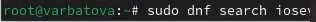{#fig:015 width=70%}
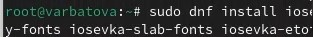{#fig:016 width=70%}

## Установка доп по

Устанавливаю бинарный файл

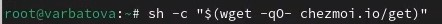{#fig:017 width=70%}

## Установка доп по

Создаю свой репозиторий для конфигурационных файлов на основе шаблона

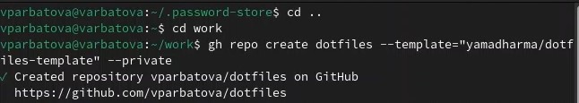{#fig:018 width=70%}

## Установка доп по

 Инициализирую chezmoi с моим репозиторием
 
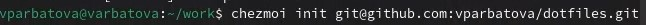{#fig:019 width=70%}

## Установка доп по

Проверяю, какие изменения внесены в домашний каталог

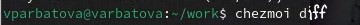{#fig:020 width=70%}

## Установка доп по

Меня устроили внесенные изменения

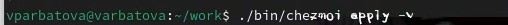{#fig:021 width=70%}

# Выводы

Я установила всё необходимое

# Список литературы{.unnumbered}

::: {#refs}
:::
