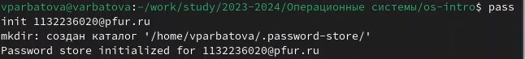

---
## Front matter
title: "Отчёт по лабораторной работе №5"
subtitle: "Операционные системы"
author: "Арбатова Варвара Петровна"

## Generic otions
lang: ru-RU
toc-title: "Содержание"

## Bibliography
bibliography: bib/cite.bib
csl: pandoc/csl/gost-r-7-0-5-2008-numeric.csl

## Pdf output format
toc: true # Table of contents
toc-depth: 2
lof: true # List of figures
lot: true # List of tables
fontsize: 12pt
linestretch: 1.5
papersize: a4
documentclass: scrreprt
## I18n polyglossia
polyglossia-lang:
  name: russian
  options:
	- spelling=modern
	- babelshorthands=true
polyglossia-otherlangs:
  name: english
## I18n babel
babel-lang: russian
babel-otherlangs: english
## Fonts
mainfont: PT Serif
romanfont: PT Serif
sansfont: PT Sans
monofont: PT Mono
mainfontoptions: Ligatures=TeX
romanfontoptions: Ligatures=TeX
sansfontoptions: Ligatures=TeX,Scale=MatchLowercase
monofontoptions: Scale=MatchLowercase,Scale=0.9
## Biblatex
biblatex: true
biblio-style: "gost-numeric"
biblatexoptions:
  - parentracker=true
  - backend=biber
  - hyperref=auto
  - language=auto
  - autolang=other*
  - citestyle=gost-numeric
## Pandoc-crossref LaTeX customization
figureTitle: "Рис."
tableTitle: "Таблица"
listingTitle: "Листинг"
lofTitle: "Список иллюстраций"
lotTitle: "Список таблиц"
lolTitle: "Листинги"
## Misc options
indent: true
header-includes:
  - \usepackage{indentfirst}
  - \usepackage{float} # keep figures where there are in the text
  - \floatplacement{figure}{H} # keep figures where there are in the text
---

# Цель работы

Настройка рабочей среды, установка менеджера паролей pass 

# Задание

Установка и настройка менеджера паролей pass, настройка управления файлами конфигурации, установка дополнительного по

# Теоретическое введение

Менеджер паролей pass — программа, сделанная в рамках идеологии Unix.
Также носит название стандартного менеджера паролей для Unix (The standard Unix password manager).

# Выполнение лабораторной работы

## Установка менеджера паролей pass

Скачиваю pass

{#fig:001 width=70%}

Скачиваю gopass

{#fig:002 width=70%}

Просматриваю список ключей GPG 

{#fig:003 width=70%}

Инициализирую хранилище

{#fig:004 width=70%}

Создаю структуру git

{#fig:005 width=70%}

Создаю новый репозиторий

{#fig:006 width=70%}

7-8: Синхронизирую

{#fig:007 width=70%}
{#fig:008 width=70%}

Коммичу изменения вручную

{#fig:009 width=70%}

Проверяю статус изменений

{#fig:010 width=70%}

11-12: Устанавливаю интерфейс взаимодействия с броузером - native messaging
 
{#fig:011 width=70%}
{#fig:012 width=70%}

Создала файл, на который буду ставить пароль, затем - задаю этот пароль, отображаю его и заменяю на генерируемый автоматически

{#fig:013 width=70%}

14-16: Установка шрифтов. Я забыла скриншот сделать, но до этого было установлено по

{#fig:014 width=70%}
{#fig:015 width=70%}
{#fig:016 width=70%}

Устанавливаю бинарный файл

{#fig:017 width=70%}

Создаю свой репозиторий для конфигурационных файлов на основе шаблона

{#fig:018 width=70%}

 Инициализирую chezmoi с моим репозиторием
 
{#fig:019 width=70%}

Проверяю, какие изменения внесены в домашний каталог

{#fig:020 width=70%}

Меня устроили внесенные изменения

{#fig:021 width=70%}

# Выводы

# Список литературы{.unnumbered}

::: {#refs}
:::
