---
## Front matter
lang: ru-RU
title: Презентация по лабораторной работе №6
subtitle: Операционные системы
author:
  - Арбатова В.П., НКАбд-01-23
institute:
  - Российский университет дружбы народов, Москва, Россия
date: 16 марта 2024

## i18n babel
babel-lang: russian
babel-otherlangs: english

## Formatting pdf
toc: false
toc-title: Содержание
slide_level: 2
aspectratio: 169
section-titles: true
theme: metropolis
header-includes:
 - \metroset{progressbar=frametitle,sectionpage=progressbar,numbering=fraction}
 - '\makeatletter'
 - '\beamer@ignorenonframefalse'
 - '\makeatother'
---

# Цель работы

Приобретение практических навыков взаимодействия пользователя с системой по-
средством командной строки.

# Задание

. Определите полное имя вашего домашнего каталога. Далее относительно этого ката-
лога будут выполняться последующие упражнения.
2. Выполните следующие действия:
2.1. Перейдите в каталог /tmp.
2.2. Выведите на экран содержимое каталога /tmp. Для этого используйте команду ls
с различными опциями. Поясните разницу в выводимой на экран информации.
2.3. Определите, есть ли в каталоге /var/spool подкаталог с именем cron
2.4. Перейдите в Ваш домашний каталог и выведите на экран его содержимое. Опре-
делите, кто является владельцем файлов и подкаталогов
3. Выполните следующие действия:
3.1. В домашнем каталоге создайте новый каталог с именем newdir.
3.2. В каталоге ~/newdir создайте новый каталог с именем morefun.
3.3. В домашнем каталоге создайте одной командой три новых каталога с именами
letters, memos, misk. Затем удалите эти каталоги одной командой.
3.4. Попробуйте удалить ранее созданный каталог ~/newdir командой rm. Проверьте,
был ли каталог удалён.
3.5. Удалите каталог ~/newdir/morefun из домашнего каталога. Проверьте, был ли
каталог удалён.
4. С помощью команды man определите, какую опцию команды ls нужно использо-
вать для просмотра содержимое не только указанного каталога, но и подкаталогов,
входящих в него.
5. С помощью команды man определите набор опций команды ls, позволяющий отсорти-
ровать по времени последнего изменения выводимый список содержимого каталога
с развёрнутым описанием файлов.
6. Используйте команду man для просмотра описания следующих команд: cd, pwd, mkdir,
rmdir, rm. Поясните основные опции этих команд.
7. Используя информацию, полученную при помощи команды history, выполните мо-
дификацию и исполнение нескольких команд из буфера команд.

# Теоретическое введение

В операционной системе типа Linux взаимодействие пользователя с системой обычно
осуществляется с помощью командной строки посредством построчного ввода ко-
манд. При этом обычно используется командные интерпретаторы языка shell: /bin/sh;
/bin/csh; /bin/ksh.

# Выполнение лабораторной работы
## 1

Определяю путь к домашнему каталогу

{#fig:001 width=70%}

## 2

Перехожу в каталог tmp

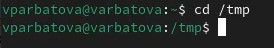{#fig:002 width=70%}

## 2

Просматриваю содержимое каталога 

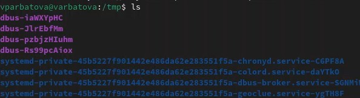{#fig:003 width=70%}

## 2

Включая скрытые папки

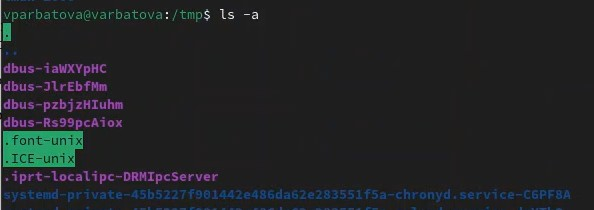{#fig:004 width=70%}

В первом случае вывелись все папки, в начале названия которых нет ".". То есть все, кроме так называемых скрытых. Во втором - вообще все, включая скрытые

## 2

Я забыла сделать скриншот, но в каталоге var/spool не было подкаталога с именем corn, поределила я это с помощью команды ls /var/spool, что можно увидеть в скринкасте выполняемой работы
Перехожу в домашний каталог и вывожу его содержимое

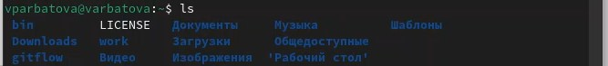{#fig:005 width=70%}

## 2

Переход в домашний каталог

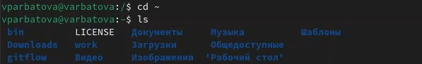{#fig:006 width=70%}

## 2

Определяю, кто является владельцем, это я

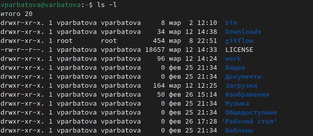{#fig:007 width=70%}

## 3

Создаю в домашнем каталоге каталог, затем в этом каталоге создаю ещё один, затем создаю 3 каталога одной командой, проверяю, создались они или нет

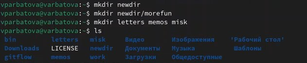{#fig:008 width=70%}

## 3

Удаляю каталог, проверяю удалился ли он

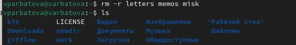{#fig:009 width=70%}

## 3

Удаляю ещё один каталог и проверяю

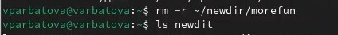{#fig:010 width=70%}

## 4-6

Опция ls для просмотра содержимое не только указанного каталога, но и подкаталогов,
входящих в него -a
Набор опций команды ls, позволяющий отсорти-
ровать по времени последнего изменения выводимый список содержимого каталога
с развёрнутым описанием файлов -t -l

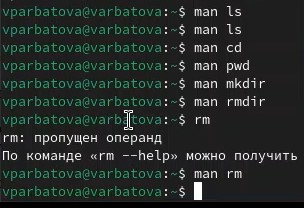{#fig:011 width=70%}

## 7

С помощью history смотрю последние команды 

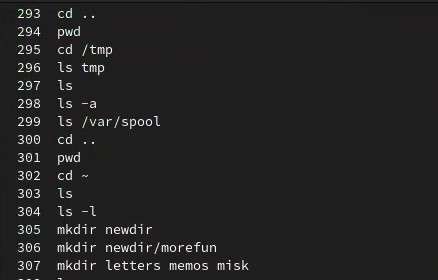{#fig:012 width=70%}

## 7

Выполняю модификацию, исполняю нескольких команд из буфера обмена

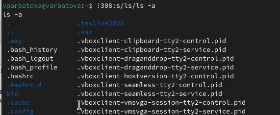{#fig:013 width=70%}

# Выводы

Я приобрела практические навыки взаимодействия пользователя с системой по-
средством командной строки.

# Список литературы{.unnumbered}

::: {#refs}
:::
