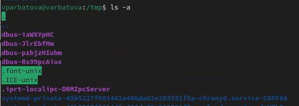
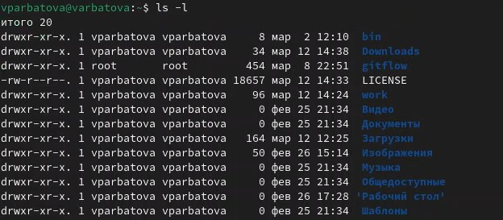
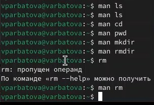
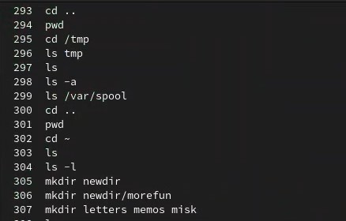
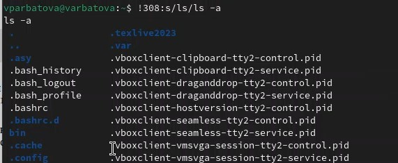

---
## Front matter
title: "Отчёт по лабораторной работе №6"
subtitle: "Операционные системы"
author: "Арбатова Варвара Петровна" 

## Generic otions
lang: ru-RU
toc-title: "Содержание"

## Bibliography
bibliography: bib/cite.bib
csl: pandoc/csl/gost-r-7-0-5-2008-numeric.csl

## Pdf output format
toc: true # Table of contents
toc-depth: 2
lof: true # List of figures
lot: true # List of tables
fontsize: 12pt
linestretch: 1.5
papersize: a4
documentclass: scrreprt
## I18n polyglossia
polyglossia-lang:
  name: russian
  options:
	- spelling=modern
	- babelshorthands=true
polyglossia-otherlangs:
  name: english
## I18n babel
babel-lang: russian
babel-otherlangs: english
## Fonts
mainfont: PT Serif
romanfont: PT Serif
sansfont: PT Sans
monofont: PT Mono
mainfontoptions: Ligatures=TeX
romanfontoptions: Ligatures=TeX
sansfontoptions: Ligatures=TeX,Scale=MatchLowercase
monofontoptions: Scale=MatchLowercase,Scale=0.9
## Biblatex
biblatex: true
biblio-style: "gost-numeric"
biblatexoptions:
  - parentracker=true
  - backend=biber
  - hyperref=auto
  - language=auto
  - autolang=other*
  - citestyle=gost-numeric
## Pandoc-crossref LaTeX customization
figureTitle: "Рис."
tableTitle: "Таблица"
listingTitle: "Листинг"
lofTitle: "Список иллюстраций"
lotTitle: "Список таблиц"
lolTitle: "Листинги"
## Misc options
indent: true
header-includes:
  - \usepackage{indentfirst}
  - \usepackage{float} # keep figures where there are in the text
  - \floatplacement{figure}{H} # keep figures where there are in the text
---

# Цель работы

Приобретение практических навыков взаимодействия пользователя с системой по-
средством командной строки.

# Задание

. Определите полное имя вашего домашнего каталога. Далее относительно этого ката-
лога будут выполняться последующие упражнения.
2. Выполните следующие действия:
2.1. Перейдите в каталог /tmp.
2.2. Выведите на экран содержимое каталога /tmp. Для этого используйте команду ls
с различными опциями. Поясните разницу в выводимой на экран информации.
2.3. Определите, есть ли в каталоге /var/spool подкаталог с именем cron
2.4. Перейдите в Ваш домашний каталог и выведите на экран его содержимое. Опре-
делите, кто является владельцем файлов и подкаталогов
3. Выполните следующие действия:
3.1. В домашнем каталоге создайте новый каталог с именем newdir.
3.2. В каталоге ~/newdir создайте новый каталог с именем morefun.
3.3. В домашнем каталоге создайте одной командой три новых каталога с именами
letters, memos, misk. Затем удалите эти каталоги одной командой.
3.4. Попробуйте удалить ранее созданный каталог ~/newdir командой rm. Проверьте,
был ли каталог удалён.
3.5. Удалите каталог ~/newdir/morefun из домашнего каталога. Проверьте, был ли
каталог удалён.
4. С помощью команды man определите, какую опцию команды ls нужно использо-
вать для просмотра содержимое не только указанного каталога, но и подкаталогов,
входящих в него.
5. С помощью команды man определите набор опций команды ls, позволяющий отсорти-
ровать по времени последнего изменения выводимый список содержимого каталога
с развёрнутым описанием файлов.
6. Используйте команду man для просмотра описания следующих команд: cd, pwd, mkdir,
rmdir, rm. Поясните основные опции этих команд.
7. Используя информацию, полученную при помощи команды history, выполните мо-
дификацию и исполнение нескольких команд из буфера команд.

# Теоретическое введение

В операционной системе типа Linux взаимодействие пользователя с системой обычно
осуществляется с помощью командной строки посредством построчного ввода ко-
манд. При этом обычно используется командные интерпретаторы языка shell: /bin/sh;
/bin/csh; /bin/ksh.

# Выполнение лабораторной работы
## 1

Определяю путь к домашнему каталогу

{#fig:001 width=70%}

## 2

Перехожу в каталог tmp

{#fig:002 width=70%}

Просматриваю содержимое каталога 

{#fig:003 width=70%}

Включая скрытые папки

{#fig:004 width=70%}

В первом случае вывелись все папки, в начале названия которых нет ".". То есть все, кроме так называемых скрытых. Во втором - вообще все, включая скрытые

Я забыла сделать скриншот, но в каталоге var/spool не было подкаталога с именем corn, поределила я это с помощью команды ls /var/spool, что можно увидеть в скринкасте выполняемой работы

Перехожу в домашний каталог и вывожу его содержимое

{#fig:005 width=70%}
Переход в домашний каталог
{#fig:006 width=70%}

Определяю, кто является владельцем, это я

{#fig:007 width=70%}

## 3

Создаю в домашнем каталоге каталог, затем в этом каталоге создаю ещё один, затем создаю 3 каталога одной командой, проверяю, создались они или нет

{#fig:008 width=70%}

Удаляю каталог, проверяю удалился ли он

{#fig:009 width=70%}

Удаляю ещё один каталог и проверяю

{#fig:010 width=70%}

## 4-6

Опция ls для просмотра содержимое не только указанного каталога, но и подкаталогов,
входящих в него -a
Набор опций команды ls, позволяющий отсорти-
ровать по времени последнего изменения выводимый список содержимого каталога
с развёрнутым описанием файлов -t -l

{#fig:011 width=70%}

## 7

С помощью history смотрю последние команды 

{#fig:012 width=70%}

Выполняю модификацию, исполняю нескольких команд из буфера обмена

{#fig:013 width=70%}

# Выводы

Я приобрела практические навыки взаимодействия пользователя с системой по-
средством командной строки.

# Список литературы{.unnumbered}

::: {#refs}
:::
