---
## Front matter
lang: ru-RU
title: Презентация по лабораторной работе №7
subtitle: Операционные системы
author:
  - Арбатова В. П.
institute:
  - Российский университет дружбы народов, Москва, Россия
date: 21 марта 2024

## i18n babel
babel-lang: russian
babel-otherlangs: english

## Formatting pdf
toc: false
toc-title: Содержание
slide_level: 2
aspectratio: 169
section-titles: true
theme: metropolis
header-includes:
 - \metroset{progressbar=frametitle,sectionpage=progressbar,numbering=fraction}
 - '\makeatletter'
 - '\beamer@ignorenonframefalse'
 - '\makeatother'
---

# Цель работы

Ознакомление с файловой системой Linux, её структурой, именами и содержанием
каталогов. Приобретение практических навыков по применению команд для работы
с файлами и каталогами, по управлению процессами (и работами), по проверке использования диска и обслуживанию файловой системы.

# Задание

Перемещение по файловой системе, переименование, копирование и перемещение файлов и каталогов, смена прав доступа

# Выполнение лабораторной работы

## 1

Выполняю задания из примеров
Перехожу в домашний каталог, создаю файл abc1, копирую этот файл с новым именем 2 раза, проверяю
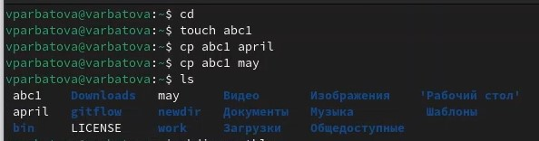{#fig:001 width=70%}

## 1

Создаю каталог, копирую 2 файла в каталог, проверяю
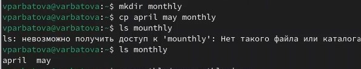{#fig:002 width=70%}

## 1

Копирую файл в папке с новым именем
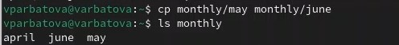{#fig:003 width=70%}

## 1

Создаю директорию, копирую один каталог в другой
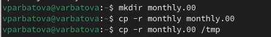{#fig:004 width=70%}

## 1

Проверяю предыдущее действие
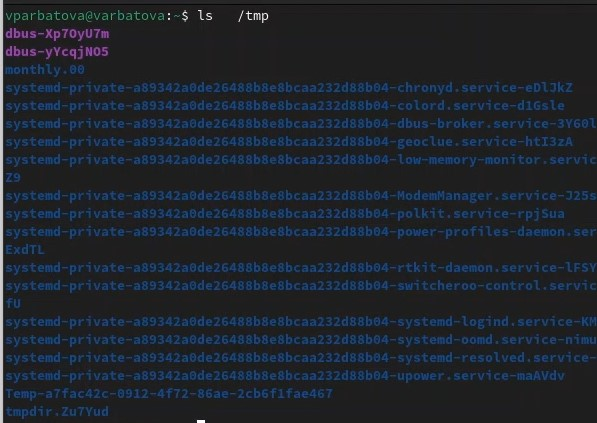{#fig:005 width=70%}

## 1

Переименовываю файл
{#fig:006 width=70%}

## 1

Перемещаю файл в папку
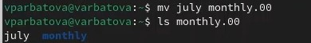{#fig:007 width=70%}

## 1

Переименовываю папку, создаю директорию, перемещаю папку в созданную и там переименовываю, проверяю
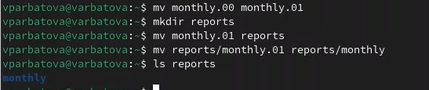{#fig:008 width=70%}

## 1

Перехожу в домашний каталог, создаю файл, смотрю права доступа к нему, изменяю права доступа
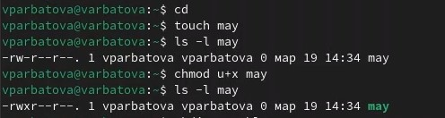{#fig:009 width=70%}

## 1

Меняю права доступа, проверяю изменились ли они, проверяю, есть ли ошибки в системе
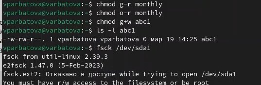{#fig:010 width=70%}

## 2

Копирую файл в домашний каталог с новым именем, проверяю, создаю новую директорию, перемещаю туда скопированный файл, переименовываю его там, проверяю
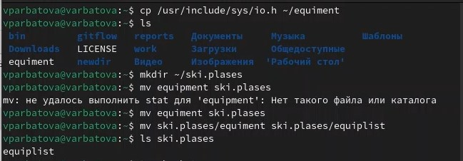{#fig:011 width=70%}

## 2

Создаю файл, копирую его с новым именем, удаляю файл, копирую оставшийся и переименовываю, создаю директорию, перемещаю каталоги
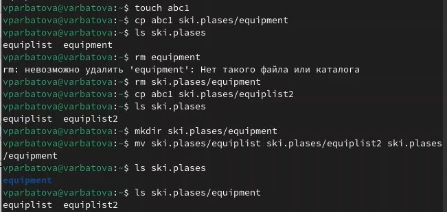{#fig:012 width=70%}

## 2

Создаю новую папку, перемещаю её в другую с новым именем
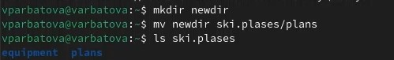{#fig:013 width=70%}

## 3

Создаю 2 папки и 2 файла
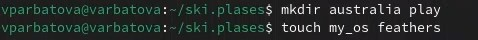{#fig:014 width=70%}

## 3

Устанавливаю права доступа и проверяю
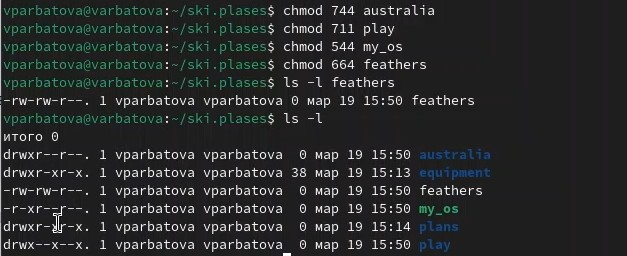{#fig:015 width=70%}

## 4 

Выполняю задания из 4 номера, подробно расскажу в защите презентации
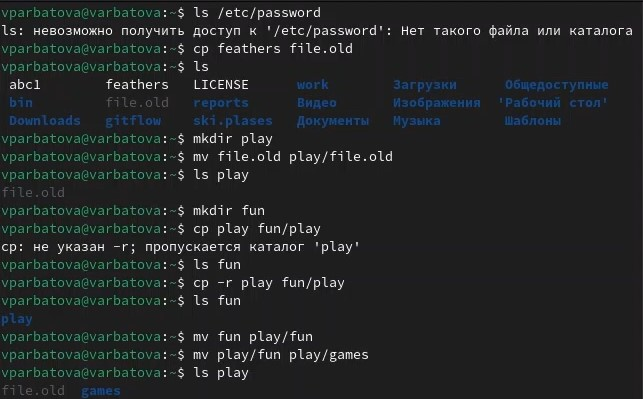{#fig:016 width=70%}

## 4

Задания на изменения прав
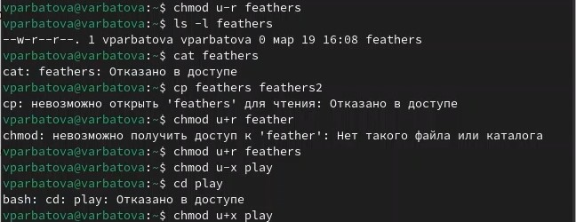{#fig:017 width=70%}

##5

Смотрю функционал команд, характеризовала их во время выполнения и сделаю это в защите презентации
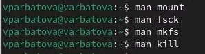{#fig:018 width=70%}

# Выводы

Я ознакомилась с файловой системой Linux, её структурой, именами и содержанием
каталогов. Приобрела практические навыки по применению команд для работы
с файлами и каталогами, по управлению процессами (и работами), по проверке использования диска и обслуживанию файловой системы.

# Список литературы{.unnumbered}

::: {#refs}
:::

:::

