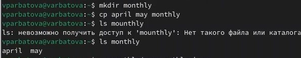

---
## Front matter
title: "Отчёт по лабораторной работе №7"
subtitle: "Операционные системы"
author: "Арбаатова Варвара Петровна"

## Generic otions
lang: ru-RU
toc-title: "Содержание"

## Bibliography
bibliography: bib/cite.bib
csl: pandoc/csl/gost-r-7-0-5-2008-numeric.csl

## Pdf output format
toc: true # Table of contents
toc-depth: 2
lof: true # List of figures
lot: true # List of tables
fontsize: 12pt
linestretch: 1.5
papersize: a4
documentclass: scrreprt
## I18n polyglossia
polyglossia-lang:
  name: russian
  options:
	- spelling=modern
	- babelshorthands=true
polyglossia-otherlangs:
  name: english
## I18n babel
babel-lang: russian
babel-otherlangs: english
## Fonts
mainfont: PT Serif
romanfont: PT Serif
sansfont: PT Sans
monofont: PT Mono
mainfontoptions: Ligatures=TeX
romanfontoptions: Ligatures=TeX
sansfontoptions: Ligatures=TeX,Scale=MatchLowercase
monofontoptions: Scale=MatchLowercase,Scale=0.9
## Biblatex
biblatex: true
biblio-style: "gost-numeric"
biblatexoptions:
  - parentracker=true
  - backend=biber
  - hyperref=auto
  - language=auto
  - autolang=other*
  - citestyle=gost-numeric
## Pandoc-crossref LaTeX customization
figureTitle: "Рис."
tableTitle: "Таблица"
listingTitle: "Листинг"
lofTitle: "Список иллюстраций"
lotTitle: "Список таблиц"
lolTitle: "Листинги"
## Misc options
indent: true
header-includes:
  - \usepackage{indentfirst}
  - \usepackage{float} # keep figures where there are in the text
  - \floatplacement{figure}{H} # keep figures where there are in the text
---

# Цель работы

Ознакомление с файловой системой Linux, её структурой, именами и содержанием
каталогов. Приобретение практических навыков по применению команд для работы
с файлами и каталогами, по управлению процессами (и работами), по проверке использования диска и обслуживанию файловой системы.

# Задание

Перемещение по файловой системе, переименование, копирование и перемещение файлов и каталогов, смена прав доступа

# Выполнение лабораторной работы

## 1

Выполняю задания из примеров
Перехожу в домашний каталог, создаю файл abc1, копирую этот файл с новым именем 2 раза, проверяю
{#fig:001 width=70%}
Создаю каталог, копирую 2 файла в каталог, проверяю
{#fig:002 width=70%}
Копирую файл в папке с новым именем
{#fig:003 width=70%}
Создаю директорию, копирую один каталог в другой
{#fig:004 width=70%}
Проверяю предыдущее действие
{#fig:005 width=70%}
Переименовываю файл
{#fig:006 width=70%}
Перемещаю файл в папку
{#fig:007 width=70%}
Переименовываю папку, создаю директорию, перемещаю папку в созданную и там переименовываю, проверяю
{#fig:008 width=70%}
Перехожу в домашний каталог, создаю файл, смотрю права доступа к нему, изменяю права доступа
{#fig:009 width=70%}
Меняю права доступа, проверяю изменились ли они, проверяю, есть ли ошибки в системе
{#fig:010 width=70%}

## 2

Копирую файл в домашний каталог с новым именем, проверяю, создаю новую директорию, перемещаю туда скопированный файл, переименовываю его там, проверяю
{#fig:011 width=70%}
Создаю файл, копирую его с новым именем, удаляю файл, копирую оставшийся и переименовываю, создаю директорию, перемещаю каталоги
{#fig:012 width=70%}
Создаю новую папку, перемещаю её в другую с новым именем
{#fig:013 width=70%}

## 3

Создаю 2 папки и 2 файла
{#fig:014 width=70%}
Устанавливаю права доступа и проверяю
{#fig:015 width=70%}

## 4 

Выполняю задания из 4 номера, подробно расскажу в защите презентации
{#fig:016 width=70%}
Задания на изменения прав
{#fig:017 width=70%}

##5

Смотрю функционал команд, характеризовала их во время выполнения и сделаю это в защите презентации
{#fig:018 width=70%}

# Выводы

Я ознакомилась с файловой системой Linux, её структурой, именами и содержанием
каталогов. Приобрела практические навыки по применению команд для работы
с файлами и каталогами, по управлению процессами (и работами), по проверке использования диска и обслуживанию файловой системы.

# Список литературы{.unnumbered}

::: {#refs}
:::
