---
## Front matter
title: "Отчёт по лабораторной работе №9"
subtitle: "Операционные системы"
author: "Арбатова Варвара Петровна"

## Generic otions
lang: ru-RU
toc-title: "Содержание"

## Bibliography
bibliography: bib/cite.bib
csl: pandoc/csl/gost-r-7-0-5-2008-numeric.csl

## Pdf output format
toc: true # Table of contents
toc-depth: 2
lof: true # List of figures
lot: true # List of tables
fontsize: 12pt
linestretch: 1.5
papersize: a4
documentclass: scrreprt
## I18n polyglossia
polyglossia-lang:
  name: russian
  options:
	- spelling=modern
	- babelshorthands=true
polyglossia-otherlangs:
  name: english
## I18n babel
babel-lang: russian
babel-otherlangs: english
## Fonts
mainfont: PT Serif
romanfont: PT Serif
sansfont: PT Sans
monofont: PT Mono
mainfontoptions: Ligatures=TeX
romanfontoptions: Ligatures=TeX
sansfontoptions: Ligatures=TeX,Scale=MatchLowercase
monofontoptions: Scale=MatchLowercase,Scale=0.9
## Biblatex
biblatex: true
biblio-style: "gost-numeric"
biblatexoptions:
  - parentracker=true
  - backend=biber
  - hyperref=auto
  - language=auto
  - autolang=other*
  - citestyle=gost-numeric
## Pandoc-crossref LaTeX customization
figureTitle: "Рис."
tableTitle: "Таблица"
listingTitle: "Листинг"
lofTitle: "Список иллюстраций"
lotTitle: "Список таблиц"
lolTitle: "Листинги"
## Misc options
indent: true
header-includes:
  - \usepackage{indentfirst}
  - \usepackage{float} # keep figures where there are in the text
  - \floatplacement{figure}{H} # keep figures where there are in the text
---

# Цель работы

Освоение основных возможностей командной оболочки Midnight Commander. Приоб-
ретение навыков практической работы по просмотру каталогов и файлов; манипуляций
с ними.

# Задание

1. Изучите информацию о mc, вызвав в командной строке man mc.
2. Запустите из командной строки mc, изучите его структуру и меню.
3. Выполните несколько операций в mc, используя управляющие клавиши (операции
с панелями; выделение/отмена выделения файлов, копирование/перемещение фай-
лов, получение информации о размере и правах доступа на файлы и/или каталоги
и т.п.)
4. Выполните основные команды меню левой (или правой) панели. Оцените степень
подробности вывода информации о файлах.
5. Используя возможности подменю Файл , выполните:
– просмотр содержимого текстового файла;
– редактирование содержимого текстового файла (без сохранения результатов
редактирования);
– создание каталога;
– копирование в файлов в созданный каталог.
6. С помощью соответствующих средств подменю Команда осуществите:
– поиск в файловой системе файла с заданными условиями (например, файла
с расширением .c или .cpp, содержащего строку main);
– выбор и повторение одной из предыдущих команд;
– переход в домашний каталог;
– анализ файла меню и файла расширений.
7. Вызовите подменю Настройки . Освойте операции, определяющие структуру экрана mc
(Full screen, Double Width, Show Hidden Files и т.д.)

# Теоретическое введение

Командная оболочка — интерфейс взаимодействия пользователя с операционной систе-
мой и программным обеспечением посредством команд.
Midnight Commander (или mc) — псевдографическая командная оболочка для UNIX/Linux
систем. Для запуска mc необходимо в командной строке набрать mc и нажать Enter
Рабочее пространство mc имеет две панели, отображающие по умолчанию списки
файлов двух каталогов 

# Выполнение лабораторной работы

## 1

С помощью команды man узнаю информацию о mc

{#fig:001 width=70%}

## 2

Открываю mc и изучаю структуру и меню

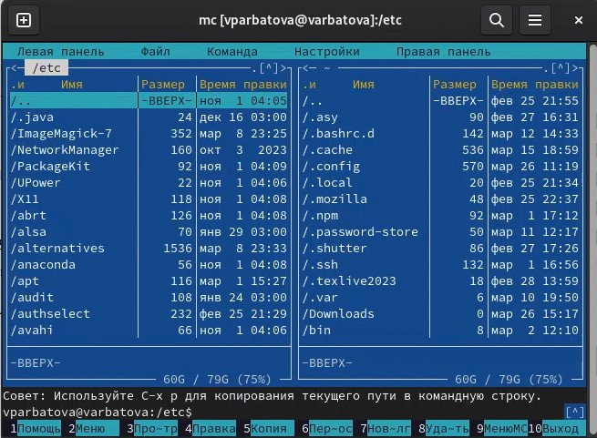{#fig:002 width=70%}

## 3

Выделяю файлы правой кнопкой мыши

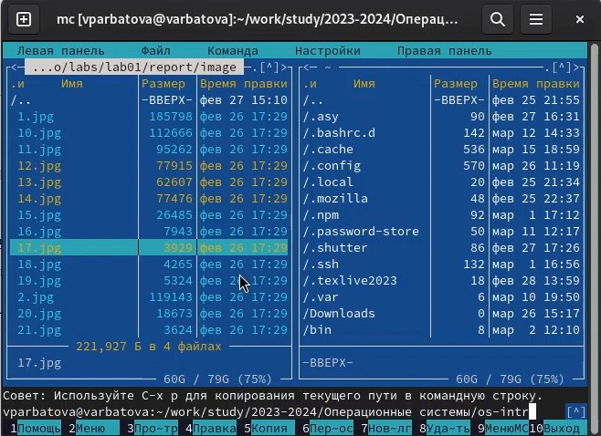{#fig:003 width=70%}

## 3

Копирую файлы с помощью клавиши f5

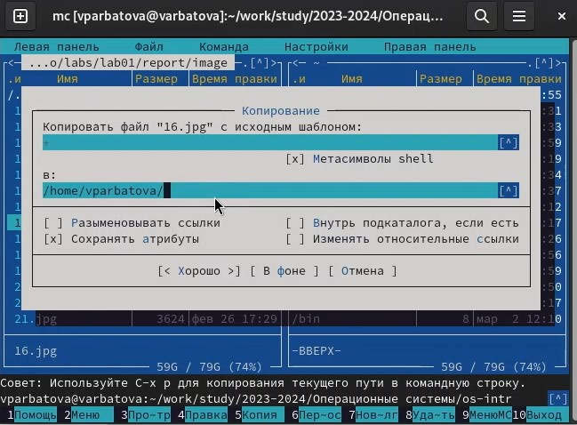{#fig:004 width=70%}

## 3

Перемещаю файл с помощью клавиши f6

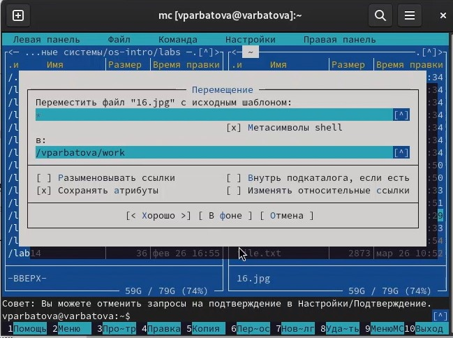{#fig:005 width=70%}

## 3-4

Получаю информацию о правах доступа и получаю информацию о файле

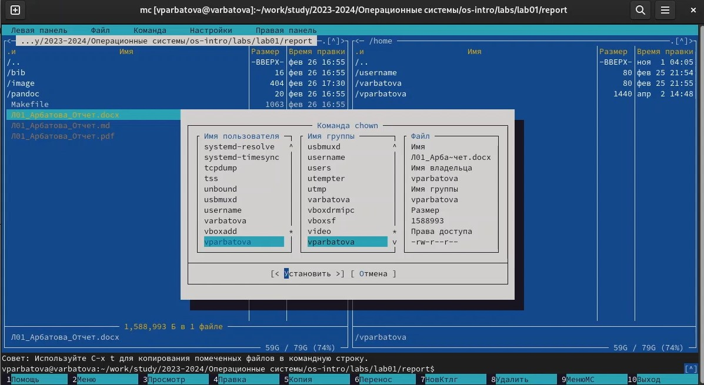{#fig:006 width=70%}

## 5

С помощью f3 просматриваю содержимое текстового файла, с помощью f4 выполняю правку файла

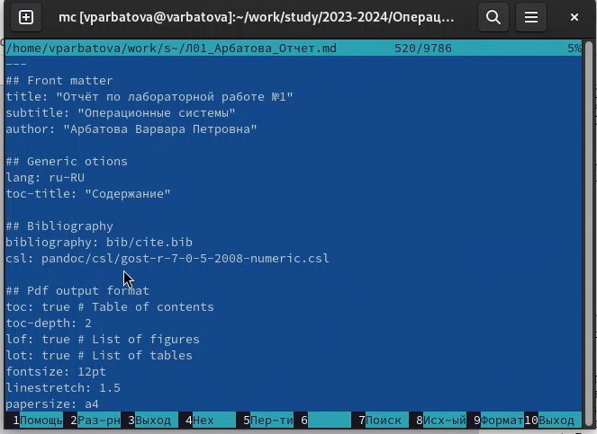{#fig:007 width=70%}

## 5

Создаю каталог 

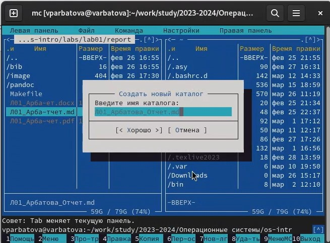{#fig:008 width=70%}

## 5

Копирую файлы в созданный каталог с помощью f5

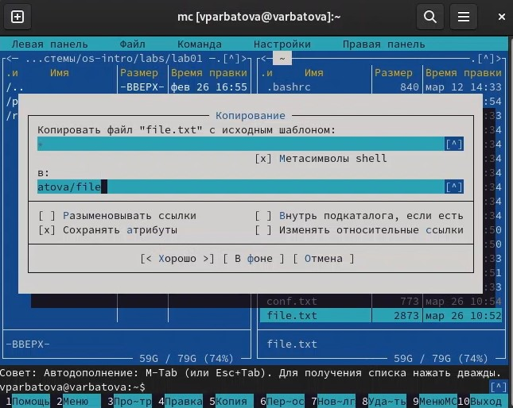{#fig:009 width=70%}

## 6

Ищу файл по шаблону названия

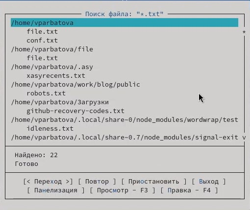{#fig:010 width=70%}

## 6

Ищу файл, содержащий конкретную строчку

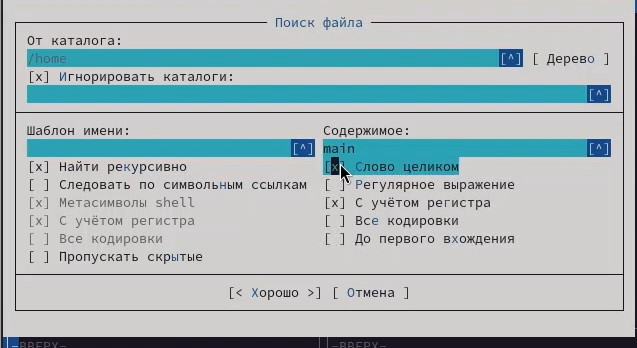{#fig:011 width=70%}

## 6

Просматриваю историю

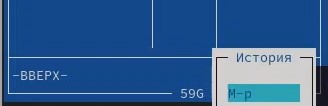{#fig:012 width=70%}

## 6

Перехожу в домашний каталог через каталоги быстрого доступа

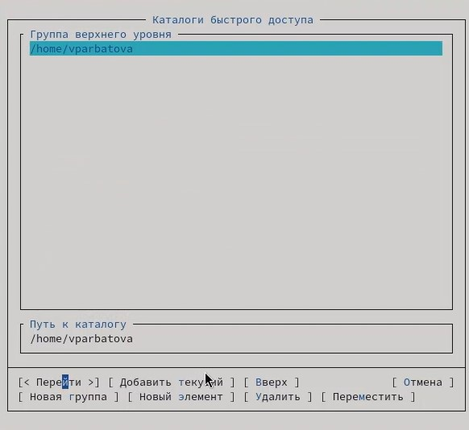{#fig:013 width=70%}

## 6

Анализирую файл меню и файл расширений

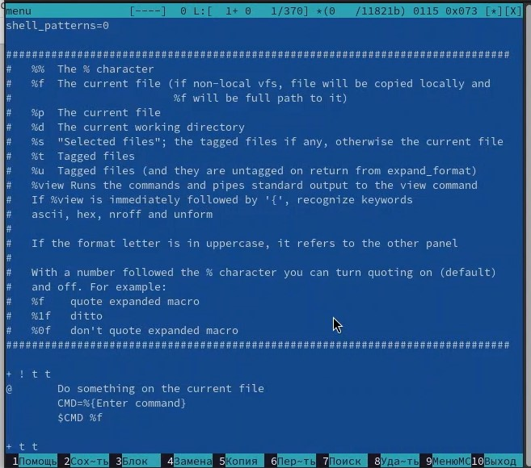{#fig:014 width=70%}

## 7

Смотрю настройки mc

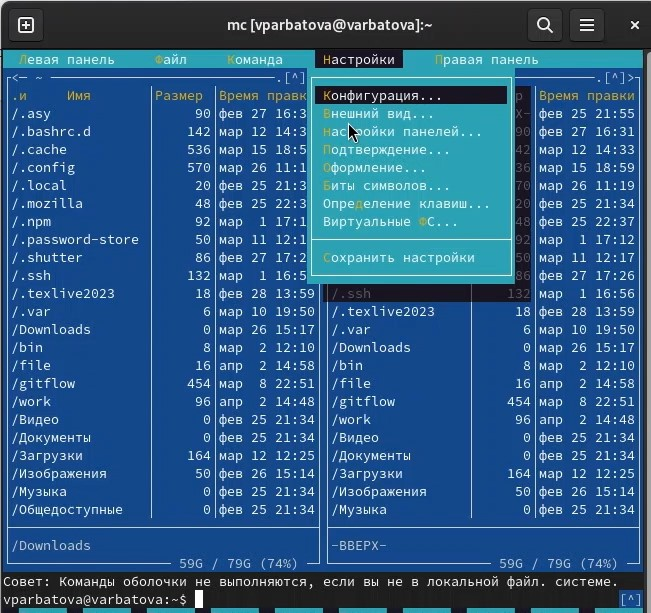{#fig:015 width=70%}

## 8

Создаю файл и открываю его с помощью текстового редактора

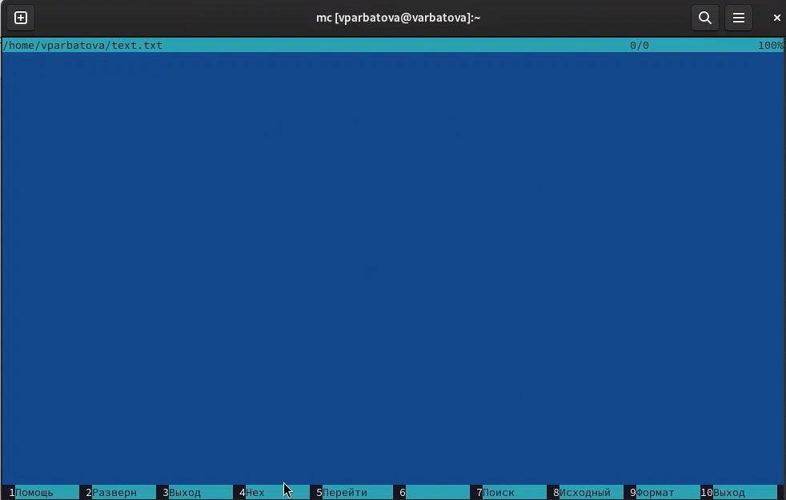{#fig:016 width=70%}

## 8

Вставляю фрагмент текста, удаляю строку из текста, выделяю фрагмент текста и копирую его на новую строку, сохраняю файл, перехожу в начало и в конец файла

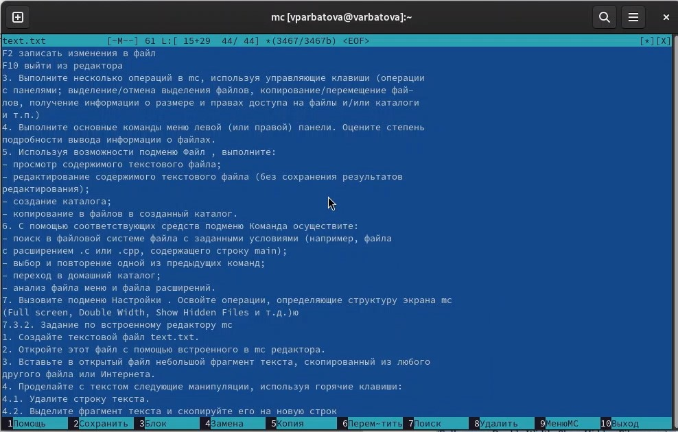{#fig:017 width=70%}

## 8

Открываю файл и включаю подсветку синтаксиса с помощью ctrl+S

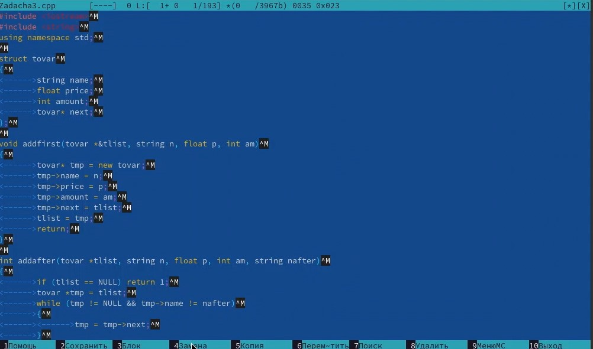{#fig:018 width=70%}

# Выводы

Я освоила основные возможности командной оболочки Midnight Commander. Приоб-
рела навыки практической работы по просмотру каталогов и файлов; манипуляций
с ними.

# Список литературы{.unnumbered}

::: {#refs}
:::
