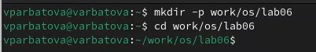
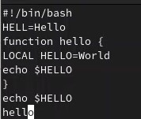
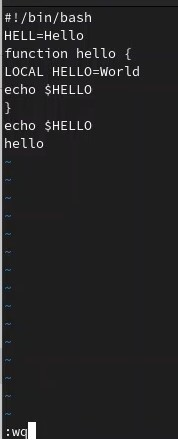
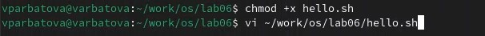
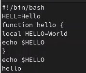

---
## Front matter
lang: ru-RU
title: Презентация по лабораторной работе №10
subtitle: Операционные системы
author:
  - Арбатова В.П.
institute:
  - Российский университет дружбы народов, Москва, Россия
date: 12 апреля 2024 г.

## i18n babel
babel-lang: russian
babel-otherlangs: english

## Formatting pdf
toc: false
toc-title: Содержание
slide_level: 2
aspectratio: 169
section-titles: true
theme: metropolis
header-includes:
 - \metroset{progressbar=frametitle,sectionpage=progressbar,numbering=fraction}
 - '\makeatletter'
 - '\beamer@ignorenonframefalse'
 - '\makeatother'
---

# Цель работы

Познакомиться с операционной системой Linux. Получить практические навыки работы с редактором vi, установленным по умолчанию практически во всех дистрибутивах.

# Задание

1. Ознакомиться с теоретическим материалом.
2. Ознакомиться с редактором vi.
3. Выполнить упражнения, используя команды vi.

# Теоретическое введение

В большинстве дистрибутивов Linux в качестве текстового редактора по умолчанию
устанавливается интерактивный экранный редактор vi (Visual display editor).
Редактор vi имеет три режима работы:
– командный режим — предназначен для ввода команд редактирования и навигации по
редактируемому файлу;
– режим вставки — предназначен для ввода содержания редактируемого файла;
– режим последней (или командной) строки — используется для записи изменений в файл
и выхода из редактора.
Для вызова редактора vi необходимо указать команду vi и имя редактируемого файла:
vi <имя_файла>
При этом в случае отсутствия файла с указанным именем будет создан такой файл.
Переход в командный режим осуществляется нажатием клавиши Esc . Для выхода из
редактора vi необходимо перейти в режим последней строки: находясь в командном
режиме, нажать Shift-; (по сути символ : — двоеточие), затем:
– набрать символы wq, если перед выходом из редактора требуется записать изменения
в файл;
– набрать символ q (или q!), если требуется выйти из редактора без сохранения.

# Выполнение лабораторной работы

## Задание 1

Создаю кааталог с именем work/os/lab06, перехожу туда

{#fig:001 width=70%}

## Задание 1

Вызываю vi и создаю файл hello.sh

{#fig:002 width=70%}

## Задание 1

Нажимаю i, чтобы иметь возможность вводить текст и ввожу его

{#fig:003 width=70%}

## Задание 1

Далее нажимаю esc, чтобы выйти из режима редактирования текста, нажимаю : и wq, чтобы записать и выйти

{#fig:004 width=70%}

## Задание 1

Делаю файл исполняемым, затем открываю его в редакторе

{#fig:005 width=70%}

## Задание 2

С помощью стелочек устанавливаю курсор в конце слова HELL второй строчки, нажимаю i, редактирую слово. чтоб оно стало HELLO, нажимаю esc. Устанавливаю курсор после LOCAL и нажимаю d0, чтобы удалить строку от начал строки до положения курсора, далее нажимаю i и редактирую слово. Устанавливаю курсор на предпоследней строчке, нажимаю Y, чтобы скопировать её, затем перехожу на последнюю строку и нажимаю p. Далее выхожу и нажимаю dd, чтобы удалить последнюю строку. Затем нажиммаю u для отмены последнего действия. Далее нажимаю :wq

{#fig:006 width=70%}

# Выводы

Я познакомилась с операционной системой Linux, Получила практические навыки работы с редактором vi, установленным по умолчанию практически во всех дистрибутивах.

# Список литературы{.unnumbered}

::: {#refs}
:::
