---
## Front matter
lang: ru-RU
title: Презентация по первому этапу проекта
subtitle: Операционные системы
author:
  - Арбатова Варвара Петровна
institute:
  - Российский университет дружбы народов, Москва, Россия
date: 2 марта 2024

## i18n babel
babel-lang: russian
babel-otherlangs: english

## Formatting pdf
toc: false
toc-title: Содержание
slide_level: 2
aspectratio: 169
section-titles: true
theme: metropolis
header-includes:
 - \metroset{progressbar=frametitle,sectionpage=progressbar,numbering=fraction}
 - '\makeatletter'
 - '\beamer@ignorenonframefalse'
 - '\makeatother'
---

# Цель работы

Размещение на Github pages заготовки для персонального сайта.

# Задание

Установить необходимое программное обеспечение.
Скачать шаблон темы сайта.
Разместить его на хостинге git.
Установить параметр для URLs сайта.
Разместить заготовку сайта на Github pages.

# Выполнение лабораторной работы

## Установка необходимого ПО

Скачиваю версию исполняемого файла hugo

{#fig:001 width=70%}

## Установка необходимого ПО

Перехожу в загрузки, проверяю наличие файла, распаковываю его

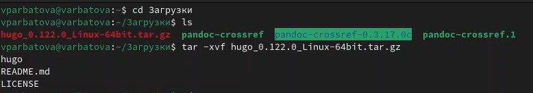{#fig:002 width=70%}

## Установка необходимого ПО

Перехожу в домашний каталог, создаю каталог bin, перемещаю hugo из загрузок в bin

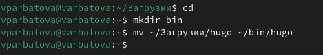{#fig:003 width=70%}

## Скачивание шаблона темы сайта

Перехожу в репозиторий на github и копирую его к себе

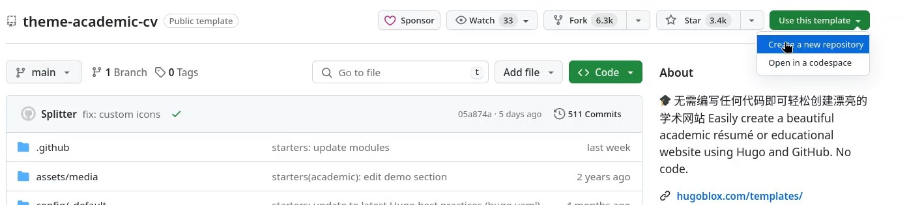{#fig:004 width=70%}

## Скачивание шаблона темы сайта

Даю имя своему репозиторию 

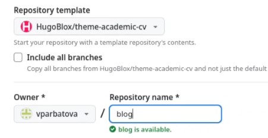{#fig:005 width=70%}

## Скачивание шаблона темы сайта

Перехожу в work, клонирую туда свой репозиторий

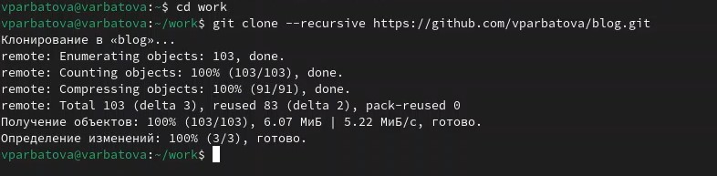{#fig:006 width=70%}

## Скачивание шаблона темы сайта

Перехожу в blog, запускаю исполняемый файл

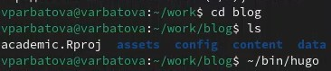{#fig:007 width=70%}

## Скачивание шаблона темы сайта

Удаляю папку public

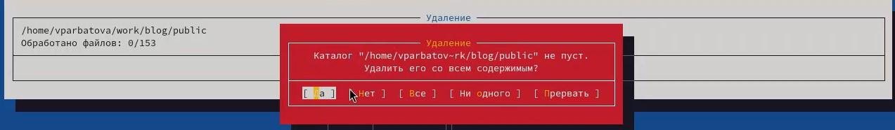{#fig:008 width=70%}

## Размещение на хостинге git

Снова запускаю исполняемый файл

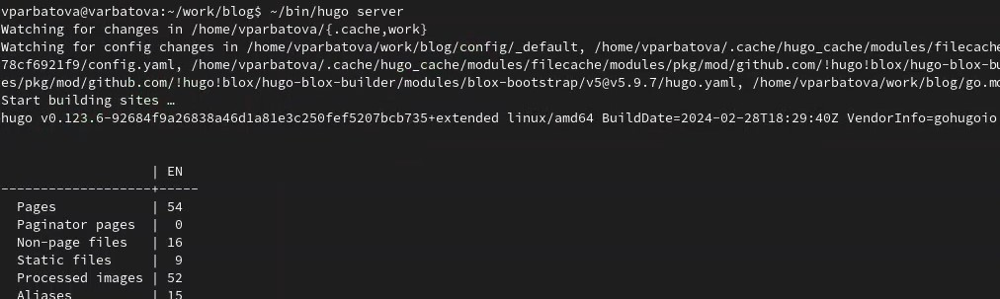{#fig:009 width=70%}

## Размещение на хостинге git

Появляется ссылка, перехожу по ней и попадаю на заготовку сайта

{#fig:010 width=70%}

## Установка параметра для URLs сайта
Создаю ещё один репозиторий

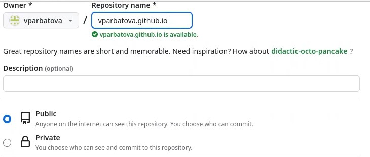{#fig:011 width=70%}

## Установка параметра для URLs сайта

Клонирую созданный репозиторий в work

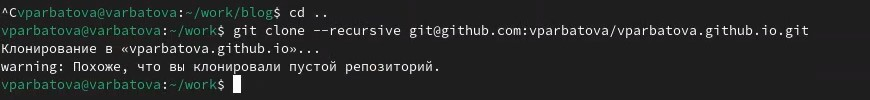{#fig:012 width=70%}

## Установка параметра для URLs сайта

Создаю ветку main, создаю README.md - пустой файл, выгружаю изменения

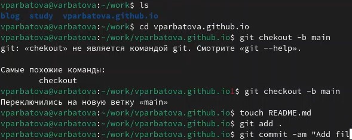{#fig:013 width=70%}

## Установка параметра для URLs сайта

Перед тем, как взаимодействовать с папкой, надо убрать её из списка игнорируемых

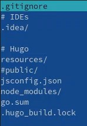{#fig:014 width=70%}

## Установка параметра для URLs сайта

Подключаю репозиторий к каталогу public

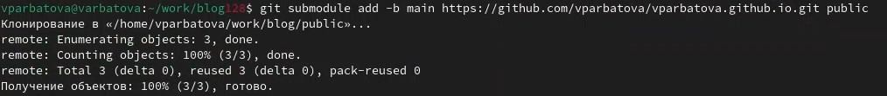{#fig:015 width=70%}

## Размещение заготовки сайта

Проверяю подключений, выгружаю изменение

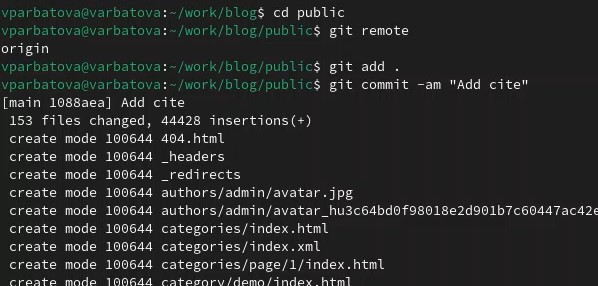{#fig:016 width=70%}

## Размещение заготовки сайта

Перехожу по ссылке, сайт создался

{#fig:017 width=70%}

# Выводы

Я разместила на github pages заготовки персонального сайта

# Список литературы{.unnumbered}

::: {#refs}
:::
