---
## Front matter
title: "Отчёт по первому этапу индивидуального проекта"
subtitle: "Операционные системы"
author: "Арбатова Варвара Петровна"

## Generic otions
lang: ru-RU
toc-title: "Содержание"

## Bibliography
bibliography: bib/cite.bib
csl: pandoc/csl/gost-r-7-0-5-2008-numeric.csl

## Pdf output format
toc: true # Table of contents
toc-depth: 2
lof: true # List of figures
lot: true # List of tables
fontsize: 12pt
linestretch: 1.5
papersize: a4
documentclass: scrreprt
## I18n polyglossia
polyglossia-lang:
  name: russian
  options:
	- spelling=modern
	- babelshorthands=true
polyglossia-otherlangs:
  name: english
## I18n babel
babel-lang: russian
babel-otherlangs: english
## Fonts
mainfont: PT Serif
romanfont: PT Serif
sansfont: PT Sans
monofont: PT Mono
mainfontoptions: Ligatures=TeX
romanfontoptions: Ligatures=TeX
sansfontoptions: Ligatures=TeX,Scale=MatchLowercase
monofontoptions: Scale=MatchLowercase,Scale=0.9
## Biblatex
biblatex: true
biblio-style: "gost-numeric"
biblatexoptions:
  - parentracker=true
  - backend=biber
  - hyperref=auto
  - language=auto
  - autolang=other*
  - citestyle=gost-numeric
## Pandoc-crossref LaTeX customization
figureTitle: "Рис."
tableTitle: "Таблица"
listingTitle: "Листинг"
lofTitle: "Список иллюстраций"
lotTitle: "Список таблиц"
lolTitle: "Листинги"
## Misc options
indent: true
header-includes:
  - \usepackage{indentfirst}
  - \usepackage{float} # keep figures where there are in the text
  - \floatplacement{figure}{H} # keep figures where there are in the text
---

# Цель работы

Размещение на Github pages заготовки для персонального сайта.

# Задание

Установить необходимое программное обеспечение.
Скачать шаблон темы сайта.
Разместить его на хостинге git.
Установить параметр для URLs сайта.
Разместить заготовку сайта на Github pages.

# Выполнение лабораторной работы

Скачиваю версию исполняемого файла hugo

{#fig:001 width=70%}

Перехожу в загрузки, проверяю наличие файла, распаковываю его

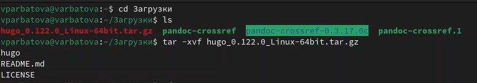{#fig:002 width=70%}

Перехожу в домашний каталог, создаю каталог bin, перемещаю hugo из загрузок в bin

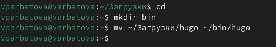{#fig:003 width=70%}

Перехожу в репозиторий на github и копирую его к себе

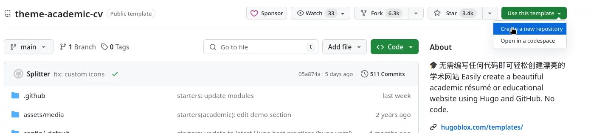{#fig:004 width=70%}

Даю имя своему репозиторию 

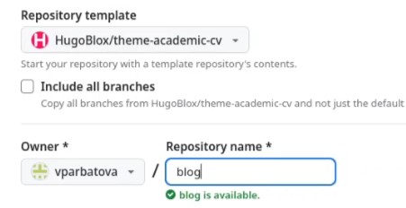{#fig:005 width=70%}

Перехожу в work, клонирую туда свой репозиторий

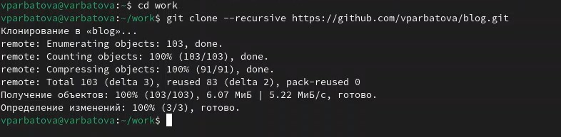{#fig:006 width=70%}

Перехожу в blog, запускаю исполняемый файл

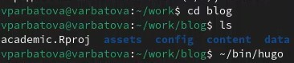{#fig:007 width=70%}

Удаляю папку public

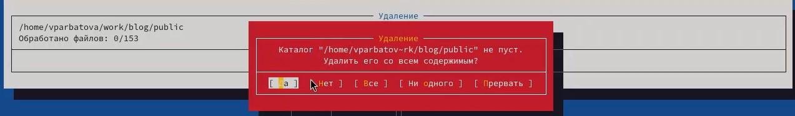{#fig:008 width=70%}

Снова запускаю исполняемый файл

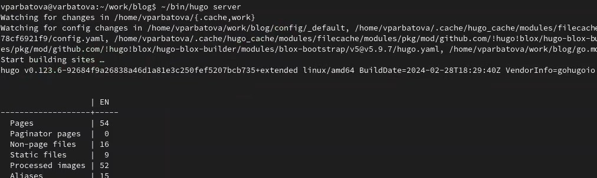{#fig:009 width=70%}

Появляется ссылка, перехожу по ней и попадаю на заготовку сайта

{#fig:010 width=70%}

Создаю ещё один репозиторий

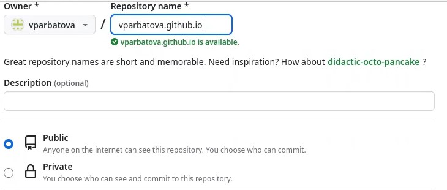{#fig:011 width=70%}

Клонирую созданный репозиторий в work

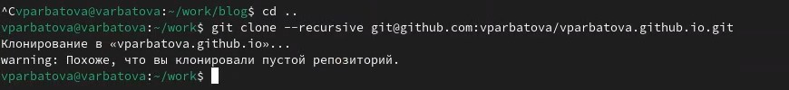{#fig:012 width=70%}

Создаю ветку main, создаю README.md - пустой файл, выгружаю изменения

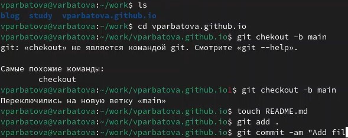{#fig:013 width=70%}

Перед тем, как взаимодействовать с папкой, надо убрать её из списка игнорируемых

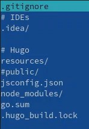{#fig:014 width=70%}

Подключаю репозиторий к каталогу public

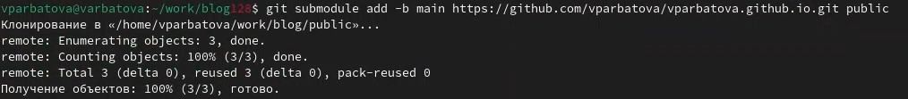{#fig:015 width=70%}

Проверяю подключений, выгружаю изменение

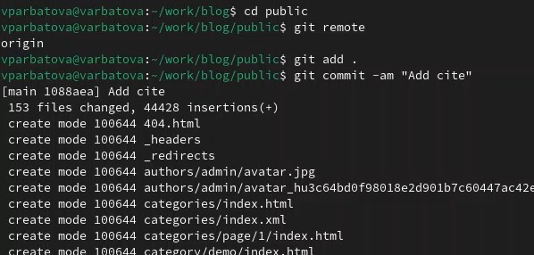{#fig:016 width=70%}

Перехожу по ссылке, сайт создался

{#fig:017 width=70%}

# Выводы

Я разместила на github pages заготовки персонального сайта

# Список литературы{.unnumbered}

::: {#refs}
:::
