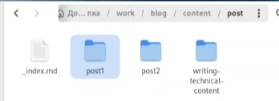

---
## Front matter
lang: ru-RU
title: Презентация по второму этапу индивидуального проекта
subtitle: Операционные системы
author:
  - Арбатова В. П., НКАбд-01-23
institute:
  - Российский университет дружбы народов, Москва, Россия
date: 11 марта 2024

## i18n babel
babel-lang: russian
babel-otherlangs: english

## Formatting pdf
toc: false
toc-title: Содержание
slide_level: 2
aspectratio: 169
section-titles: true
theme: metropolis
header-includes:
 - \metroset{progressbar=frametitle,sectionpage=progressbar,numbering=fraction}
 - '\makeatletter'
 - '\beamer@ignorenonframefalse'
 - '\makeatother'
---

# Цель работы

Добавить к сайту информацию о себе

# Задание

Разместить фотографию владельца сайта.
Разместить краткое описание владельца сайта (Biography).
Добавить информацию об интересах (Interests).
Добавить информацию от образовании (Education).
Сделать пост по прошедшей неделе.
Добавить пост на тему управление версиями. Git.

# Выполнение лабораторной работы

## Добавление фото

Скачиваю свою фотографию (взяла из выпускного альбома, может потом найду что-то лучше), добавляю его в папку content/authors/admin

{#fig:001 width=70%}

## Добавление фото

Переименовываю фотографию и удаляю старую

{#fig:002 width=70%}

## Описание владельца сайта

Меняю имя на своё

{#fig:003 width=70%}

## Краткая биография и интересы

Добавляю краткую биографию и интересы

{#fig:004 width=70%}

## Образование 

Добавляю образование (что вспомнила и закончила, остальное пока не указывала, когда появится необходимость и возможность, добавлю)

{#fig:005 width=70%}

## Образование 

Добавляю информацию о сфере деятельности сейчас и об организации

{#fig:006 width=70%}

## Описание владельца сайта

Добавляю имя, которое будет на титульном листе

{#fig:007 width=70%}

## Описание владельца сайта

Добавляю полную информацию

{#fig:008 width=70%}

## Работа с сайтом

Запускаю синхронизацию с сайтом

{#fig:009 width=70%}

## Работа с сайтом

Проверяю, как выглядит сайт

{#fig:010 width=70%}

## Посты

Создаю папки post1 и post2 в папке content/post

{#fig:011 width=70%}

## Посты

Создаю пост про прошлую неделю

{#fig:012 width=70%}

## Посты

Создаю пост про управление версиями git

{#fig:013 width=70%}

# Выводы

Я добавила на сайт информацию о себе

# Список литературы{.unnumbered}

::: {#refs}
:::
