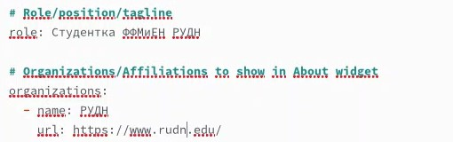
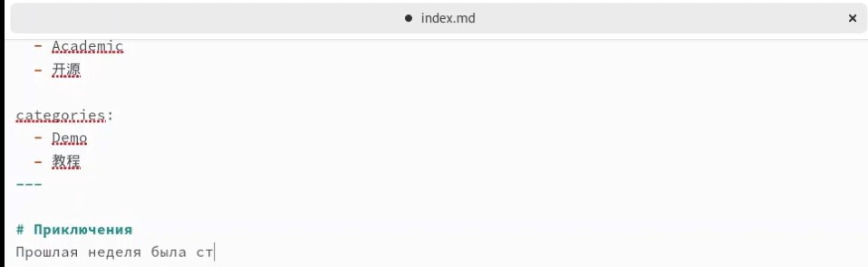

---
## Front matter
title: "Отчёт по 2 этапу индивидуального проекта"
subtitle: "Операционные системы"
author: "Арбатова Варвара Петровна"

## Generic otions
lang: ru-RU
toc-title: "Содержание"

## Bibliography
bibliography: bib/cite.bib
csl: pandoc/csl/gost-r-7-0-5-2008-numeric.csl

## Pdf output format
toc: true # Table of contents
toc-depth: 2
lof: true # List of figures
lot: true # List of tables
fontsize: 12pt
linestretch: 1.5
papersize: a4
documentclass: scrreprt
## I18n polyglossia
polyglossia-lang:
  name: russian
  options:
	- spelling=modern
	- babelshorthands=true
polyglossia-otherlangs:
  name: english
## I18n babel
babel-lang: russian
babel-otherlangs: english
## Fonts
mainfont: PT Serif
romanfont: PT Serif
sansfont: PT Sans
monofont: PT Mono
mainfontoptions: Ligatures=TeX
romanfontoptions: Ligatures=TeX
sansfontoptions: Ligatures=TeX,Scale=MatchLowercase
monofontoptions: Scale=MatchLowercase,Scale=0.9
## Biblatex
biblatex: true
biblio-style: "gost-numeric"
biblatexoptions:
  - parentracker=true
  - backend=biber
  - hyperref=auto
  - language=auto
  - autolang=other*
  - citestyle=gost-numeric
## Pandoc-crossref LaTeX customization
figureTitle: "Рис."
tableTitle: "Таблица"
listingTitle: "Листинг"
lofTitle: "Список иллюстраций"
lotTitle: "Список таблиц"
lolTitle: "Листинги"
## Misc options
indent: true
header-includes:
  - \usepackage{indentfirst}
  - \usepackage{float} # keep figures where there are in the text
  - \floatplacement{figure}{H} # keep figures where there are in the text
---

# Цель работы

Добавить к сайту информацию о себе

# Задание

Разместить фотографию владельца сайта.
Разместить краткое описание владельца сайта (Biography).
Добавить информацию об интересах (Interests).
Добавить информацию от образовании (Education).
Сделать пост по прошедшей неделе.
Добавить пост на тему управление версиями. Git.

# Выполнение лабораторной работы

## Добавление фото

Скачиваю свою фотографию (взяла из выпускного альбома, может потом найду что-то лучше), добавляю его в папку content/authors/admin

{#fig:001 width=70%}

Переименовываю фотографию и удаляю старую

{#fig:002 width=70%}

## Описание владельца сайта

Меняю имя на своё

{#fig:003 width=70%}

## Краткая биография и интересы

Добавляю краткую биографию и интересы

{#fig:004 width=70%}

## Образование 

Добавляю образование (что вспомнила и закончила, остальное пока не указывала, когда появится необходимость и возможность, добавлю)

{#fig:005 width=70%}

Добавляю информацию о сфере деятельности сейчас и об организации

{#fig:006 width=70%}

Добавляю имя, которое будет на титульном листе

{#fig:007 width=70%}

Добавляю полную информацию

{#fig:008 width=70%}

Запускаю синхронизацию с сайтом

{#fig:009 width=70%}

Проверяю, как выглядит сайт

{#fig:010 width=70%}

Создаю папки post1 и post2 в папке content/post

{#fig:011 width=70%}

Создаю пост про прошлую неделю

{#fig:012 width=70%}

Создаю пост про управление версиями git

{#fig:013 width=70%}

# Выводы

Я добавила на сайт информацию о себе

# Список литературы{.unnumbered}

::: {#refs}
:::
